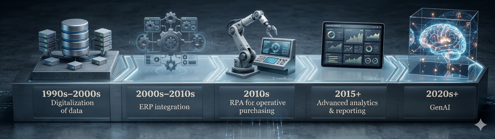

# Zwei Arten Automatisierung {background-color="#ffffff"}

::: {.columns}

::: {.column width="55%"}
::: incremental
- **Process Automation** — regelbasiertes Abarbeiten strukturierter Workflows, ohne Verstehen
- **Cognitive Automation** — KI-gestütztes Schließen, Klassifizieren, Zusammenfassen unstrukturierter Inhalte
- **Hybrid** — beide Schichten kombiniert, etwa OCR plus ERP-Einspielung
:::
:::

::: {.column width="45%"}
::: {.fragment}
{fig-align="center" width="95%"}
:::
:::

::::

::: notes
Die Pointe nach Lacity und Willcocks (2021): Beide Arten sind nicht zwei Welten, sondern Punkte auf einem Continuum. Process Automation ist deterministisch und auditierbar — perfekt für regelbasierte Tätigkeiten. Cognitive Automation ist probabilistisch und braucht eine andere Form der Qualitätssicherung. Die Frage „Was machen wir mit KI?" zerfällt damit in zwei Unterfragen: Welche Routinen lassen sich regelbasiert verlässlich machen? Wo brauchen wir wirklich Sprachverständnis?
:::

# Automatisierung ist nicht neu {background-color="#ffffff"}

::: {.columns}

::: {.column width="55%"}
::: incremental
- **ERP-Welle** — Datenintegration im Backoffice
- **RPA-Welle** — Bots klicken durch alte Anwendungen
- **Advanced-Analytics-Welle** — Vorhersagen aus historischen Daten
- **GenAI-Welle** — Sprache als Eingangs- und Ausgangsformat
:::
:::

::: {.column width="45%"}
::: {.fragment}
{fig-align="center" width="95%"}
:::
:::

::::

::: notes
Jede dieser Wellen hatte ähnliche Hürden: Datenqualität, Tool-Integration, Akzeptanz im Team, Lücke zwischen Pilot und Produktiv-Betrieb. Wer das mitnimmt, verliert die Naivität, GenAI sei kategorial neu. Was tatsächlich neu ist: die Geschwindigkeit der Adoption und die Tatsache, dass die Schnittstelle natürliche Sprache ist — kein Code, keine Maske.
:::

# Drei Tätigkeiten zum Mitdenken {background-color="#ffffff"}

::: {.columns}

::: {.column width="55%"}
::: incremental
- **Bank-zu-SAP-Abstimmung** — Process Automation
- **Belege per E-Mail-Posteingang klassifizieren** — Cognitive Automation
- **Ende-zu-Ende-Bot, der klassifiziert, einbucht, Differenzen meldet** — Intelligent Automation (Hybrid)
:::
:::

::: {.column width="45%"}
::: {.fragment}
{fig-align="center" width="95%"}
:::
:::

::::

::: notes
Jedes Beispiel begegnet Ihnen gleich im Diagnose-Quiz wieder, ergänzt um sieben weitere Items aus dem O\*NET-Profil der Accountants und Auditors. Spannend wird es bei den Hybrid-Fällen — Item 9 mit OCR plus ERP-Einspielung steht bewusst als Diskussions-Anker auf der Liste.
:::

# Übergang zur Übung 1 {background-color="#c81e0f"}

::: {style="text-align: center; margin-top: 1.5em; color: #ffffff;"}

**Diagnose-Quiz starten**

[https://th-koln-bartnik.github.io/workshop-ki-4-taa/interactions/diagnose-quiz.html](https://th-koln-bartnik.github.io/workshop-ki-4-taa/interactions/diagnose-quiz.html){style="color: #ffffff; font-size: 1.0em;"}

:::

::: notes
Zehn Items, drei Antwortoptionen, acht Minuten Solo. Dann vier Minuten Think-Pair-Share am Tisch, drei Minuten Plenum-Auflösung. Am Workshop-Ende läuft der Post-Run für den Pre/Post-Vergleich. Ziel jetzt: spontane Einschätzung, keine Recherche, keine Diskussion mit Nachbarn während der Solo-Phase.
:::
