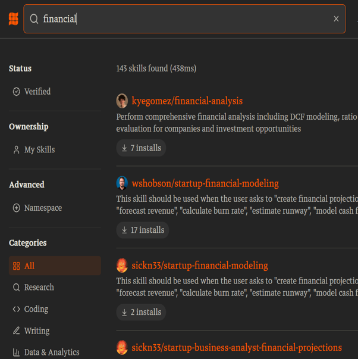

# Drei Konfigurationen, die häufig verwechselt werden {background-color="#ffffff"}

::: {.columns}

::: {.column width="55%"}
::: incremental
- **LLM allein** — ein Textgenerator, der nur reden kann
- **Erweitertes LLM** — Modell plus Harness mit Tools wie Web-Search und Datei-Upload
- **Agent** — erweitertes LLM in einer Schleife aus Ziel, Plan, Werkzeug, Bewertung
:::
:::

::: {.column width="45%"}
::: {.fragment}
{fig-align="center" width="95%"}
:::
:::

::::

::: notes
Bibliothekar-Metapher: LLM allein ist der belesene Bibliothekar, der nur reden kann. Erweitertes LLM ist derselbe Bibliothekar mit einer Werkbank — Tools, Suche, Memory. Agent ist der Bibliothekar, der eigenständig durchs Archiv läuft, Stapel verarbeitet und nach getaner Arbeit zurückkommt. Wer Aufgaben delegieren will, muss in welcher Konfiguration er steht — Fähigkeiten und Risikoprofil unterscheiden sich substanziell.
:::

# Die Harness ist wichtiger als das Modell {background-color="#ffffff"}

::: {.columns}

::: {.column width="55%"}
::: incremental
- **Web-Search** — Antworten mit Quellen
- **Code-Execution** — Berechnungen statt Schätzungen
- **Datei-Upload** — Kontext aus eigenen Dokumenten
- **Memory** — Konsistenz über mehrere Sitzungen
:::
:::

::: {.column width="45%"}
::: {.fragment}
{fig-align="center" width="95%"}
:::
:::

::::

::: notes
Faustregel aus der Praxis: am Systemwert tragen das Modell etwa dreißig Prozent bei, die Harness siebzig. Wer im Free-Tier ohne Tools arbeitet, vergleicht nicht „Modell A vs. Modell B", sondern „Halbe-Werkbank A vs. Halbe-Werkbank B". Eine starke Antwort braucht meist mindestens eines der Tools — Web-Search für Aktualität, Code-Execution für Zahlen, Datei-Upload für Mandantenkontext.
:::

# Drei Lizenz-Tiers, drei verschiedene Welten {background-color="#ffffff"}

::: {.columns}

::: {.column width="55%"}
::: incremental
- **Free** (0 €) — Hobby-Bereich, Studium, kein Mandantenbezug
- **Casual** (\~20–30 €/Monat) — Pro-Tier mit Tools und längeren Kontexten
- **Professional** (\~100–200 €/Monat) — Team-/Enterprise-Tier mit Datenschutzgarantien
:::
:::

::: {.column width="45%"}
::: {.fragment}
{fig-align="center" width="95%"}
:::
:::

::::

::: notes
Mandantenarbeit gehört nie in den Free-Tier — Eingaben werden in der Regel zum Training verwendet. Für Studium und Übungen reicht Free meistens; sobald die Aufgabe ernsthaft Quellen, lange Kontexte oder Tools braucht, lohnt der Casual-Tier. Der Professional-Tier ist die berufliche Realität nach dem Studium — wer im Hobby-Bereich übt, übt nicht für seinen späteren Berufsalltag.
:::

# Die Jagged Frontier ist real {background-color="#ffffff"}

::: {.columns}

::: {.column width="55%"}
::: incremental
- KI ist in benachbarten Aufgaben **einmal stark, einmal schwach**
- Der Unterschied ist **nicht vorhersagbar**
- Deshalb: jede Aufgabenklasse einzeln testen
:::
:::

::: {.column width="45%"}
::: {.fragment}
{fig-align="center" width="95%"}
:::
:::

::::

::: notes
Dell'Acqua, Mollick und Kollegen (2023) zeigen das empirisch: Bei BCG-Beratenden steigerte GenAI die Produktivität deutlich — aber nur bei Aufgaben innerhalb der Frontier. Bei Aufgaben am Rand der Fähigkeiten wurden Outputs schlechter, ohne dass die Studierenden es bemerkten. Konsequenz für unseren Workshop: Sie brauchen eine Test-Suite, um zu wissen, wo die Frontier in Ihrer Domäne liegt. Genau das machen wir in Übung 4.
:::

# Übergang zur Übung 2 {background-color="#c81e0f"}

::: {style="text-align: center; margin-top: 1.0em; color: #ffffff;"}

**Karriereentwicklung im Modellvergleich**

::: {style="text-align: left; max-width: 800px; margin: 1.5em auto; color: #ffffff;"}

- Schritt a — Karriereberatung an schwaches vs. starkes Modell
- Schritt b — KPMG-Überblick im Side-by-Side auf `arena.ai`
- Schritt c — Deep Research (Erweiterung für schnelle Studierende)

:::

:::

::: notes
Modelle für Schritt a: Llama 3.1 8B in der Academic Cloud gegen ein starkes Modell Ihrer Wahl. Schritt b: arena.ai, Side-by-Side mit grok-4.20-multi-agent und gpt-5.2-search. Schritt c als Erweiterung — Deep-Research-Prompt erst per RTF-Schema vom starken Modell erstellen lassen, dann den Lauf starten. 15 Minuten Solo, 4 Minuten Think-Pair-Share, 3 Minuten Plenum-Auflösung.
:::
