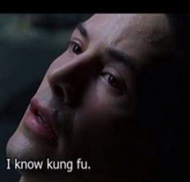

# Der Chatbot ist ein junger Nachhilfeschüler {background-color="#ffffff"}

::: {.columns}

::: {.column width="55%"}
::: incremental
- **Versteht Anweisungen**, aber wörtlich
- **Braucht Kontext**, sonst rät er
- **Lernt mit Beispielen**, schneller als mit Erklärungen
- **Macht Fehler** und bemerkt sie nicht
:::
:::

::: {.column width="45%"}
::: {.fragment}
{fig-align="center" width="95%"}
:::
:::

::::

::: notes
Mollick-Analogie: Nicht ein Taschenrechner, der präzise Zahlen produziert — sondern ein hochbegabter, aber wörtlicher Nachhilfeschüler. Wenn Sie sagen „schreib mir eine kurze Antwort", können Sie drei Sätze oder dreißig bekommen. Wenn Sie sagen „antworte für Erstsemester", können Sie ein Glossar oder eine Vereinfachung bekommen. Präzision in der Beschreibung ist deshalb keine Stil-Frage, sondern Voraussetzung für reproduzierbare Outputs.
:::

# RTF — sparsam und schnell {background-color="#ffffff"}

::: {style="font-size: 1.05em; margin-top: 0.5em;"}

::: incremental
- **R**ole — Wer antwortet?
- **T**ask — Was genau soll getan werden?
- **F**ormat — In welcher Form?
:::

::: {.fragment style="margin-top: 1em; padding: 0.8em 1em; background: #f5f5f7; border-left: 4px solid #b43092;"}
*Beispiel:* „Sie sind Wirtschaftsprüferin. Erläutern Sie das Going-Concern-Prinzip. Antworten Sie in drei kurzen Absätzen für Erstsemester."
:::

:::

::: notes
RTF ist das Minimal-Schema — drei Bausteine, in einem Satz. Eignet sich für Routineaufgaben und Schnellanfragen. Wer einen RTF-Prompt nicht in einem Satz formulieren kann, hat die Aufgabe noch nicht klar — gute Diagnose für die eigene Klarheit.
:::

# CREATE — reicher und stärker {background-color="#ffffff"}

::: {style="font-size: 0.95em;"}

::: incremental
- **C**haracter — Rolle und Expertise
- **R**equest — die konkrete Aufgabe
- **E**xamples — ein bis zwei Beispiel-Outputs
- **A**djustments — Tonalität, Verbotswörter, Constraints
- **T**ype of output — Format und Struktur
- **E**xtras — Quellenpflicht, Halluzinations-Warnung, Längenlimit
:::

:::

::: notes
CREATE ist die reichere Variante — für komplexe Aufgaben mit hohen Qualitätsanforderungen, Mandantenkommunikation oder Stellungnahmen. Examples sind der Hebel mit der größten Wirkung: ein gutes Beispiel beim Prompt einsparen vier Iterationen. Adjustments und Extras unterscheiden Profi-Prompts von Hobby-Prompts — Hobby-Prompts vergessen Constraints.
:::

# Direktvergleich an derselben Aufgabe {background-color="#ffffff"}

::: {.columns}

::: {.column width="50%"}
**RTF**

> Sie sind Wirtschaftsprüferin. Erläutern Sie das Going-Concern-Prinzip in drei kurzen Absätzen für Erstsemester.
:::

::: {.column width="50%"}
**CREATE**

> Character: erfahrene Wirtschaftsprüferin mit Lehrerfahrung an einer FH. Request: Going-Concern-Prinzip erklären. Examples: zwei mögliche Erklärungen in zwei Stilen (Lehrbuch, Praxisanekdote). Adjustments: Tonalität freundlich, keine Floskeln. Type: drei Absätze, kein Bullet. Extras: nennen Sie eine konkrete Norm (IDW PS 270).
:::

::::

::: notes
Beim Live-Demo den Unterschied selbst zeigen — eine ChatGPT- oder Claude-Session, beide Prompts hintereinander. Studierende bemerken den Unterschied sofort: CREATE produziert reicher, mit Beispielen und Norm-Bezug. RTF ist schneller und für die Routine völlig ausreichend. Pointe: Wählen Sie das Schema passend zur Aufgabe, nicht nach Gewohnheit.
:::

# Übergang zur Übung 3 {background-color="#c81e0f"}

::: {style="text-align: center; margin-top: 1.0em; color: #ffffff;"}

**Prompt-Umbau und Tutor-Bot**

::: {style="text-align: left; max-width: 800px; margin: 1.5em auto; color: #ffffff;"}

- Schritt a — Beispiel-Prompt in RTF und CREATE umbauen
- Schritt b — Tutor-Bot für eigenes Lerngebiet anpassen
- Schritt c — RAG-Tutor mit NotebookLM (Erweiterung)

:::

:::

::: notes
Beispiel-Prompt liegt in der Übungs-Beschreibung — Erklärung mit Analogien und Beispielen, fünf Metaphern. Tutor-Bot-Vorlage aus dem genai4teaching-Buch, Kapitel 7. NotebookLM-Erweiterung für die Schnellen — zeigt, was RAG am Tutor-Bot ändert. In Übung 4 testen Sie den Tutor-Bot mit Ihrer Test-Suite — daher den Bot bewusst auf Ihr Lerngebiet zuschneiden.
:::
