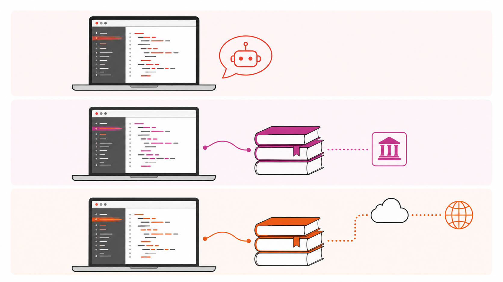

::: th-color-bar
:::

# Was Sie in zwei Nachmittagen mitnehmen

Nach zwei Workshop-Nachmittagen verfügen Sie über ein gemeinsames Vokabular für den KI-Einsatz in Tax, Audit und Advisory — vom Modellvergleich über das Prompt-Design bis zur Frage, wo *Process Automation* und *Cognitive Automation* sinnvoll zusammenfinden.

::: lernziel-box
#### Am Ende der zwei Workshops können Sie …

1.  das **4D-Framework** (Delegate, Describe, Discern, Diligence) erklären und an einem Tax-/Audit-Beispiel anwenden,
2.  **Process Automation** und **Cognitive Automation** in Tax-/Audit-Szenarien sauber unterscheiden — auch in Hybrid-Fällen,
3.  zwei KI-Modelle und zwei Modell-plus-Tool-Konfigurationen **systematisch vergleichen** und Modell-Effekte von Harness-Effekten trennen,
4.  einen Prompt nach **RTF** und **CREATE** strukturieren und einen Tutor-Bot für das eigene Lerngebiet aufsetzen,
5.  KI-**Outputs** mit einer kleinen **Test-Suite** systematisch prüfen (Red-Green-TDD nach Willison),
6.  eine begründete **persönliche AI Policy** für die spätere Berufspraxis formulieren.
:::

{fig-alt="Visualisierung des Workshop-Ablaufs als Rhythmus aus Inputs, Übungen und Diskussion über zwei Nachmittage"}

## Tagesablauf

::: callout-note
## Termine

- **Workshop 1 — Dienstag, 12.05.2026, 16:00–19:00 Uhr**
- **Workshop 2 — Mittwoch, 13.05.2026, 16:00–19:00 Uhr**
- **Ort** — Campus Südstadt, Claudiusstraße 1 (Raumnummer wird per Mail bekanntgegeben).
:::

| Zeitfenster | Workshop 1 (Di) — AI Fluency | Workshop 2 (Mi) — Automatisierung & 4D-Use-Case |
|---|---|---|
| 16:00–17:30 | Inputs und Übungen 1 (Diagnose-Quiz) und 2 (Karriereentwicklung im Modellvergleich) | Recap, BPMN-Grundlagen, UiPath-Demo, BPMN-Übung |
| 17:30–17:40 | Pause | Pause |
| 17:40–19:00 | Inputs und Übungen 3 (Prompt-Umbau und Tutor-Bot) und 4 (Tutor-Bot systematisch prüfen) | UiPath-Bot-Übung, 4D-Use-Case integriert, Discern-Vertiefung |
| nach W2 | Diligence-Anriss als Brücke zu Tag 2 | Hausaufgaben: Dilemma der Mitte (Positionspapier), Personal AI Policy |

::: callout-tip
## Tutor öffnen

[**Tutor — KI in Tax, Audit & Advisory** →](https://chatgpt.com/g/g-6a03076b4da88191b9e9ae9580a0c2ce-ki-tutor-fur-workshop-auditing-tax-advisory){target="_blank"}

Der Tutor begleitet Sie durch alle Übungen. Er kennt das 4D-Framework, die Übungstexte und die Wissensbasis dieses Skripts.
:::

::: callout-warning
## Datenschutz und Vertraulichkeit

In keinem Fall reale Mandantendaten in KI-Tools eingeben. Free-Tier-Dienste sind für Mandantenarbeit grundsätzlich nicht geeignet. Hintergrund: WPO § 43, StBerG § 57, DSGVO. Die berufsrechtliche Vertiefung folgt in Workshop 2.
:::

## Transparenz zur KI-Nutzung

Bei der Erstellung dieses Skriptes wurde **Claude 4.7 / Cowork** zur Aufwertung der Inhalte (speziell für Beispiele und Interaktionen), als Reviewer (speziell Sprach- und Konsistenzchecks) und zur Gestaltung des Layouts genutzt. Die verwendeten Bilder wurden mit **Gemini 3.1** generiert. Alle Inhalte wurden von Roman Bartnik geprüft, überarbeitet und verantwortet.

## Lizenz

Inhalte unter CC BY-NC-SA 4.0 (siehe `LICENSE`). Verwendete Quellen werden inline zitiert und am Ende jedes Kapitels aufgelistet.
