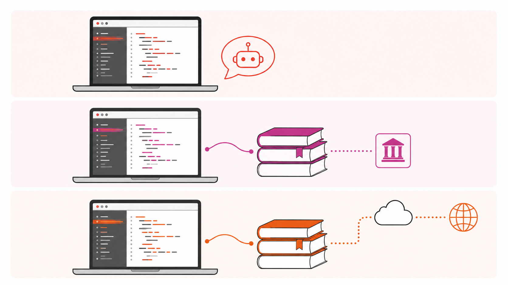

::: th-color-bar
:::

# Was Sie aus den zwei Workshops mitnehmen

Sie haben eine Übersicht über  Grundbegriffe, typische Probleme und praktische Einsatzempfehlungen von generativer KI in wissensintensiven Berufen wie Tax, Audit und Advisory.

::: lernziel-box
#### Am Ende der zwei Workshops können Sie …

1.  das **4D-Framework** (Delegate, Describe, Discern, Diligence) erklären und an einem Tax-/Audit-Beispiel anwenden,
2.  **Process Automation** und **Cognitive Automation** in Tax-/Audit-Szenarien sauber unterscheiden,
3.  KI ist nicht gleich KI - Sie können Unterschiede KI-Modellen und  Modell-plus-Tool-Konfigurationen **systematisch vergleichen** und Modell-Effekte von Harness-Effekten trennen,
4.  einen Prompt nach **RTF** und **CREATE** strukturieren und einen Tutor-Bot für das eigene Lerngebiet aufsetzen,
5.  KI-**Outputs** mit einer kleinen **Test-Suite** systematisch prüfen
:::

{fig-alt="Visualisierung des Workshop-Ablaufs als Rhythmus aus Inputs, Übungen und Diskussion über zwei Nachmittage"}

::: callout-tip
## Tutor öffnen

[**Tutor — KI in Tax, Audit & Advisory** →](https://chatgpt.com/g/g-6a03076b4da88191b9e9ae9580a0c2ce-ki-tutor-fur-workshop-auditing-tax-advisory){target="_blank"}

Der Tutor begleitet Sie durch alle Übungen. Er kennt das 4D-Framework, die Übungstexte und die Wissensbasis dieses Skripts.
:::

::: callout-warning
## Datenschutz und Vertraulichkeit

In keinem Fall reale Mandantendaten in KI-Tools eingeben. Free-Tier-Dienste sind für Mandantenarbeit grundsätzlich nicht geeignet. Hintergrund: WPO § 43, StBerG § 57, DSGVO. Die berufsrechtliche Vertiefung folgt in Workshop 2.
:::

## Transparenz zur KI-Nutzung

Bei der Erstellung dieses Skriptes wurde **Claude 4.7 / Cowork** zur Aufwertung der Inhalte (speziell für Beispiele und Interaktionen), als Reviewer (speziell Sprach- und Konsistenzchecks) und zur Gestaltung des Layouts genutzt. Die verwendeten Bilder wurden mit **Gemini 3.1** generiert. Alle Inhalte wurden von Roman Bartnik geprüft, überarbeitet und verantwortet.

## Lizenz

Inhalte unter CC BY-NC-SA 4.0 (siehe `LICENSE`). Verwendete Quellen werden inline zitiert und am Ende jedes Kapitels aufgelistet.
