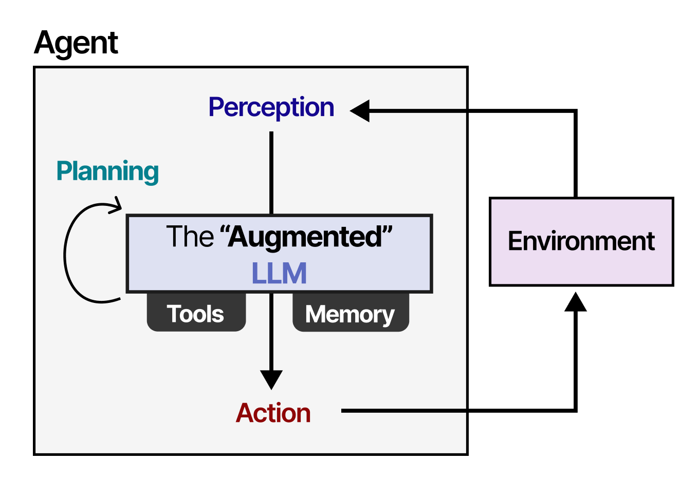

::: th-color-bar
:::

## Lernziele

::: lernziel-box
#### Was Sie nach diesem Workshop können

- *Process Automation* und *Cognitive Automation* an konkreten Tätigkeiten aus Tax, Audit und Advisory unterscheiden — und Grenzfälle als Hybrid benennen,
- das **4D-Framework** (Delegate, Describe, Discern, Diligence) in eigenen Worten erklären und die beiden Loops im Kopf nachzeichnen,
- die drei Konfigurationen **LLM allein**, **erweitertes LLM** und **Agent** unterscheiden und für eine eigene Frage die passende auswählen,
- einen einfachen Prompt nach **RTF** und **CREATE** strukturieren und an einer Aufgabe aus dem eigenen Lerngebiet anwenden,
- einen Tutor-Bot für das eigene Fachgebiet bauen und mit einer kleinen **Test-Suite** systematisch prüfen.
:::

## Vorbereitung

Was Sie vor dem Termin erledigen:

- **Diagnose-Quiz** absolvieren (10 Items, ca. 8 Minuten) → [Quiz starten](../interactions/diagnose-quiz.html){target="_blank"}. Ergebnis aufheben, am Ende des Workshops gibt es einen Re-Test mit Pre/Post-Vergleich.
- **AAA-Mapper** durchspielen (29 Tätigkeiten aus dem O\*NET-Berufsbild *Accountants and Auditors*, ca. 15–20 Minuten) → [AAA-Mapper starten](../interactions/onet-aaa-mapper.html){target="_blank"}. Auswertung mitbringen — Diskussionsmaterial für den Block *Delegate*.
- **Zugänge** anlegen oder prüfen: Account in der GWDG Academic Cloud, kostenfreier Account auf `arena.ai`, mindestens ein Free-Account bei einem starken Modell (Claude, ChatGPT, Gemini oder Perplexity). Für Übung 3 zusätzlich: NotebookLM ([notebooklm.google.com](https://notebooklm.google.com){target="_blank"}).
- **Lesen** (optional, 15 Minuten): [Wissensbasis · LLM-Grundlagen](06-wissensbasis.qmd#sec-llm-grundlagen) und [Wissensbasis · Welches Modell?](06-wissensbasis.qmd#sec-welches-modell).
- **Mitbringen**: Notebook mit Browser, Kopfhörer, eine offene Fachfrage aus Ihrem Studium oder einer früheren Praxisphase (kein Mandantenbezug).

## Inhalte des Workshops

Drei Stunden, eng verzahnt aus fünf kurzen Inputs (zusammen 53 Minuten), vier Übungen mit je 15 Minuten Bearbeitung plus Think-Pair-Share und Plenum-Auflösung (zusammen 88 Minuten), einer Pause (10 Minuten) und Begrüßung/Abschluss (9 Minuten). Alle Übungen sind im Block eingebettet, in dem ihr inhaltlicher Anker liegt — nicht in einen separaten Übungsteil verschoben.

:::: week-card
::: card-header
🟦 Block 0 — Begrüßung und Kalibrierung · 5 Min
:::

Begrüßung, Lernziele, Hinweis auf den Tutor, kurze Verständigung über Vorerfahrungen mit generativer KI.
::::

:::: week-card
::: card-header
🟦 Block 1 — Process vs. Cognitive Automation · 10 Min · [▶ Folien](../slides/01-process-vs-cognitive.html){.assignment-badge target="_blank"}
:::

**Process Automation** — regelbasiertes Abarbeiten strukturierter Workflows ohne Verstehen. **Cognitive Automation** — KI-gestütztes Schließen, Klassifizieren, Zusammenfassen unstrukturierter Inhalte. Das *Service-Automation-Continuum* nach @lacity2021becoming und @willcocks2024evolution ordnet beide Kategorien plus *Intelligent Automation* als orchestrierende Schicht in eine kohärente Sourcing-Strategie ein.

{fig-alt="Visualisierung des Service-Automation-Continuum mit den Stufen RPA, Cognitive Computing, Cognitive Automation und Intelligent Automation, jeweils mit zunehmender Komplexität und Autonomie"}

Drei Verankerungs-Beispiele aus Tax/Audit: Bank-zu-SAP-Abstimmung (Process); semantische Klassifikation eingehender Belege (Cognitive); Ende-zu-Ende-Bot, der klassifiziert, einbucht und Differenzen meldet (Intelligent Automation).

➡️ [Übung 1 — Diagnose-Quiz Process vs. Cognitive](02-uebungen-w1.qmd#sec-uebung-1){.assignment-badge} · 18 Min (8 Min Solo + 4 Min TPS + 3 Min Plenum + 3 Min Puffer)
::::

:::: week-card
::: card-header
🟦 Block 2 — 4D-Framework Kurzdurchlauf · 7 Min · [▶ Folien](../slides/02-4d-framework.html){.assignment-badge target="_blank"}
:::

Vier Kernkompetenzen, je drei Subkategorien nach @dakan2025framework. **Delegate** (Problem-, Platform-, Task-Awareness) · **Describe** (Product-, Process-, Performance-Description) · **Discern** (Product-, Process-, Performance-Discernment) · **Diligence** (Creation-, Transparency-, Deployment-Diligence). Zwei Loops: *Delegate–Diligence* (strategisch), *Describe–Discern* (operativ). Heute behandeln wir Delegate, Describe und Discern in dieser Reihenfolge; Diligence wird morgen vertieft.
::::

:::: week-card
::: card-header
🟦 Block 3 — Delegate: Modell, Harness, agentische Nutzung · 12 Min · [▶ Folien](../slides/03-delegate.html){.assignment-badge target="_blank"}
:::

Drei Konfigurationen sauber trennen:

- **LLM allein** — ein Textgenerator. Stellen Sie sich einen sehr belesenen Bibliothekar vor, der nur reden kann, nichts nachschlagen und nichts ausführen.
- **Erweitertes LLM** — dasselbe Modell, eingebettet in eine *Harness* mit Tools wie Web-Search, File-Upload, Code-Execution. Der Bibliothekar bekommt eine Werkbank.
- **Agent** — ein erweitertes LLM, das in einer Schleife arbeitet: Ziel, Plan, Werkzeug, Bewertung, neuer Plan. Der Bibliothekar erledigt eigenständig mehrschrittige Aufgaben und meldet sich erst zurück, wenn er fertig ist.

{fig-alt="Visualisierung eines LLM-Kerns, umgeben von einem Werkzeugring aus Web-Search, Memory, Tools und User Interface"}

Die didaktische Pointe: Wer Aufgaben delegieren will, muss wissen, in welcher der drei Konfigurationen das eigene System läuft, weil Fähigkeiten und Risikoprofil substanziell verschieden sind [@grootendorst2025visual; @mollick2024cointelligence].

{fig-alt="Visualisierung der Jagged Frontier als zerklüftete Linie, die starke und schwache Fähigkeitsbereiche von KI-Systemen unregelmäßig trennt"}

➡️ [Übung 2 — Karriereentwicklung im Modellvergleich](02-uebungen-w1.qmd#sec-uebung-2){.assignment-badge} · 22 Min (15 Min Übung + 4 Min TPS + 3 Min Plenum)
::::

:::: week-card
::: card-header
☕ Pause · 10 Min
:::

::::

:::: week-card
::: card-header
🟦 Block 4 — Describe: RTF und CREATE · 12 Min · [▶ Folien](../slides/04-describe.html){.assignment-badge target="_blank"}
:::

Leitanalogie: Der Chatbot ist eher ein junger Nachhilfeschüler als ein Taschenrechner — er versteht Anweisungen, braucht Kontext, möchte gezeigt bekommen, was Sie wollen, und wird mit Beispielen besser. Inhaltlicher Anker: das Kapitel *How to speak* aus dem begleitenden Lehrbuch [@bartnik2026genai4teaching].

Zwei Schemata:

- **RTF** — *Role, Task, Format*. Sparsam und schnell. Beispiel: „Sie sind Wirtschaftsprüferin. Erläutern Sie das Going-Concern-Prinzip. Antworten Sie in drei kurzen Absätzen für Erstsemester."
- **CREATE** — *Character, Request, Examples, Adjustments, Type of output, Extras*. Reicher und für komplexe Aufgaben besser geeignet. Beide Schemata mit identischer Beispielaufgabe vorführen, damit der Unterschied direkt sichtbar wird.

➡️ [Übung 3 — Prompt-Umbau und Tutor-Bot](02-uebungen-w1.qmd#sec-uebung-3){.assignment-badge} · 22 Min (15 Min Übung + 4 Min TPS + 3 Min Plenum)
::::

:::: week-card
::: card-header
🟦 Block 5 — Discern: Outputs systematisch prüfen · 12 Min · [▶ Folien](../slides/05-discern.html){.assignment-badge target="_blank"}
:::

Zwei Ideen, eine Übersetzung auf Tax/Audit:

- **RAGAS-Idee** — eine Bewertung von Antworten aus Retrieval-Augmented-Systemen entlang weniger Kerngrößen: *Faithfulness* (passt die Antwort zu den abgerufenen Quellen?), *Answer Relevance* (beantwortet sie die Frage?), *Context Precision* und *Context Recall* (wurden die richtigen Quellen abgerufen?) [@es2024ragas]. Im Kern: ein Test-Set aus Fragen mit erwarteten Antworten, das Sie immer wieder durchlaufen lassen.
- **Red-Green-TDD nach Willison** — Testfälle zuerst. Sie schreiben fünf bis zehn Beispielfragen mit gewünschten Antworten, lassen den Agenten durchlaufen, markieren *rot* (fehlerhaft), *gelb* (teilweise) oder *grün* (korrekt). Dann iterieren Sie Prompt, Modell und Harness, bis möglichst viele Tests grün werden [@willison2025redgreen]. Die Methode kommt aus dem Test-Driven Development der Software-Entwicklung — Kent Becks „Red first" auf Prompt-Ebene übertragen.

Übersetzung auf Tax/Audit: Eine kleine Sammlung typischer Berufsfragen (Anwendung des Reverse-Charge-Verfahrens, Going-Concern-Prüfung, Behandlung von Rückstellungen) wird zur Test-Suite. Genau das bauen Sie in der nächsten Übung — zum Tutor-Bot aus Übung 3.

{fig-alt="Bildhafte Darstellung von Retrieval-Augmented Generation als Bücherregal, aus dem ein KI-Assistent vor der Antwort nachschlägt"}

➡️ [Übung 4 — Tutor-Bot systematisch prüfen](02-uebungen-w1.qmd#sec-uebung-4){.assignment-badge} · 22 Min (15 Min Übung + 4 Min TPS + 3 Min Plenum)
::::

:::: week-card
::: card-header
🟧 Block 6 — Abschluss: Diagnose-Quiz Re-Test und Brücke zu Tag 2 · 9 Min
:::

Diagnose-Quiz erneut durchlaufen, Pre/Post-Vergleich als Spinnen- oder Balken-Diagramm. Brücke zu Workshop 2 (Mittwoch, 13.05.): **Diligence** als vierte Kompetenz — Verantwortung, Transparenz, Verifikation. Konkret morgen: berufsrechtliche Pflichten (WPO § 43, StBerG § 57, DSGVO), Personal AI Policy.
::::

## Diskussionsfragen

- An welcher Stelle in Ihrem Studium würde ein Tutor-Bot Sie heute schon ersetzen — und an welcher nicht?
- Item 9 des Diagnose-Quiz (OCR plus ERP-Einspielung) ist ein Hybrid aus *Cognitive* und *Process*. Wo verläuft die Grenze in einem realen Workflow Ihrer Wahl?
- Welche Konfiguration aus *LLM allein · erweitertes LLM · Agent* passt zu welcher Aufgabenklasse Ihres Studienalltags? Wo lohnt sich der Aufpreis für ein stärkeres Modell oder eine reichere Harness konkret?
- Wann ist eine Test-Suite mit fünf Fragen aussagekräftiger als eine spontane Qualitätsprüfung? Wann nicht?

## Aufgaben

::: callout-note
## Vier Übungen im Workshop, eingebettet in die Inputs

[Übung 1 — Diagnose-Quiz](02-uebungen-w1.qmd#sec-uebung-1){.assignment-badge} [Übung 2 — Karriereentwicklung](02-uebungen-w1.qmd#sec-uebung-2){.assignment-badge} [Übung 3 — Prompt-Umbau und Tutor-Bot](02-uebungen-w1.qmd#sec-uebung-3){.assignment-badge} [Übung 4 — Tutor-Bot systematisch prüfen](02-uebungen-w1.qmd#sec-uebung-4){.assignment-badge}

Jede Übung dauert maximal 15 Minuten und schließt mit Think-Pair-Share und kurzer Plenum-Auflösung. Innerhalb jeder Übung gibt es eine **Erweiterungsfrage für schnelle Studierende** — wer früh fertig ist, vertieft, statt zu warten.
:::

## Hausaufgabe zum Folgetag

Für Workshop 2 brauchen Sie zwei kostenfreie Accounts. Bitte vor der Sitzung am Mittwoch einrichten — beides dauert jeweils etwa fünf Minuten.

::: callout-note
## Zwei Accounts vor Workshop 2

- **Signavio Academic Edition** — Account anlegen unter <https://academic.signavio.com/p/explorer>. Wird in Workshop 2 für die BPMN-Modellierung des Rechnungseingangsprozesses genutzt. Hochschul-E-Mail-Adresse wird empfohlen, kostenfrei, kein Download nötig.
- **UiPath Cloud** — Account anlegen unter <https://cloud.uipath.com/>. Wird für das Lesen und Anpassen des Excel-zu-PDF-Bots genutzt. Free-Tier reicht; *Studio Web* läuft direkt im Browser, kein lokales Studio nötig.

**Bitte zu Workshop 2 mitbringen:** beide Logins (E-Mail und Passwort gespeichert oder im Browser eingeloggt). Wer keinen Account anlegen kann, schaut beim Sitznachbarn mit — verpasst aber das Hands-on.
:::

## Hintergrund / Werkzeuge / Ressourcen

- **Wissensbasis** — [LLM-Grundlagen](06-wissensbasis.qmd#sec-llm-grundlagen) · [Welches Modell?](06-wissensbasis.qmd#sec-welches-modell) · [Prompt-Muster](06-wissensbasis.qmd#sec-prompt-muster) · [Tools und Plattformen](06-wissensbasis.qmd#sec-tools).
- **Foliensatz** — `gen-ai-allgemeine-empfehlungen-2026-05.pptx` (Chat versus erweitertes Sprachmodell, drei Lizenz-Tiers, Harness, *Jagged Frontier*).
- **Originalmaterial 4D-Framework** — Cheat Sheet und Practical Overview von @dakan2025framework.
- **Begleitlehrbuch** — [Kapitel 2.4 *How to speak*](https://th-koln-bartnik.github.io/genai4teaching/kapitel02.html#sec-how-to-speak){target="_blank"} und [Kapitel 7 *Tutor-Prompt-Sammlung*](https://th-koln-bartnik.github.io/genai4teaching/kapitel07-appendix02-prompt-sammlung.html#sec-general-tutor){target="_blank"}.
- **O\*NET-Berufsbild** — [Accountants and Auditors (13-2011.00)](https://www.onetonline.org/link/summary/13-2011.00){target="_blank"} als Faktenbasis für Übung 2.
- **Vergleichsplattform** — [arena.ai](https://arena.ai){target="_blank"} mit Side-by-Side-Modus für Übung 2.

## Weiterführend

- @mollick2024cointelligence — *Co-intelligence: Living and working with AI* (Begleitlektüre zum Studium).
- @dellacqua2023navigating — *Navigating the jagged technological frontier* (HBS Working Paper, empirisch zur Produktivitätswirkung).
- @grootendorst2025visual — *A visual guide to LLM agents* (visuelle Erklärung des Harness-Konzepts und der drei Konfigurationen).
- @willison2025redgreen — *Red-green test-driven development for agentic engineering* (didaktisch klare Einführung in TDD für KI-Systeme).
- @es2024ragas — *RAGAS: Automated evaluation of retrieval augmented generation* (Originalpaper zur Bewertung von RAG-Systemen).

## Tutor

::: callout-tip
## Tutor öffnen

[Tutor — KI in Tax, Audit & Advisory →](https://chatgpt.com/g/g-6a03076b4da88191b9e9ae9580a0c2ce-ki-tutor-fur-workshop-auditing-tax-advisory){target="_blank"}

Vorschlag-Prompt für diesen Workshop:

> Ich bereite Workshop 1 (AI Fluency Framework) im Modul *KI in Tax, Audit & Advisory* vor. Bitte erklären Sie mir die Unterscheidung *Process Automation* versus *Cognitive Automation* an einem konkreten Beispiel meiner Wahl: [Beispiel einfügen]. Fragen Sie mich nach meinem Vorwissen, geben Sie eine kurze Lay-Erklärung vor jedem Fachbegriff und stellen Sie am Ende drei Diagnose-Fragen, mit denen ich mein Verständnis selbst prüfen kann.
:::

## Persönliche Anmerkungen

*Platzhalter für eigene Notizen — z. B. raumbezogene Hinweise, Beispielwahl pro Kohorte, Anpassung der Übungs-Beispiele.*
