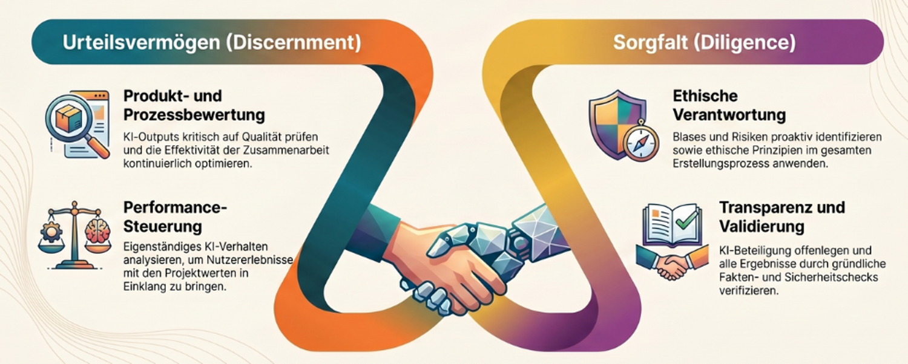
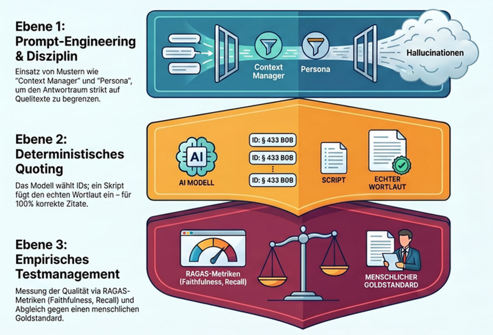
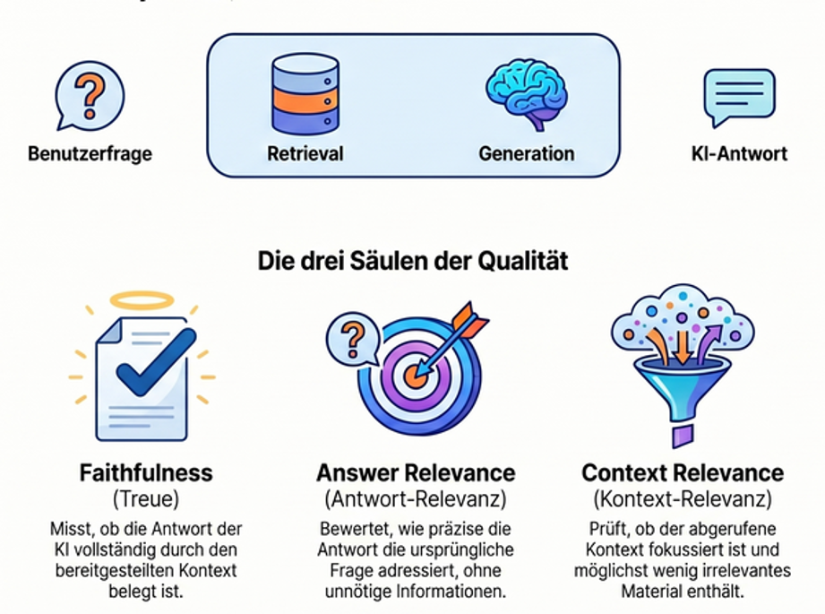
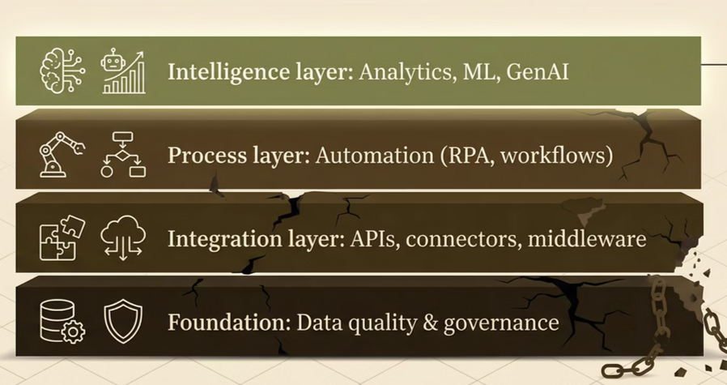

::: th-color-bar
:::

## Lernziele

::: lernziel-box
#### Was Sie nach diesem Workshop können

- Sie können einfache Qualitätsprüfungen von GenAI-Outputs in Prompts einbauen (**Qualitätsprüfung durch Prompt-Engineering**).
- Sie verstehen die Möglichkeiten und Grenzen von RAG und Techniken der detaillierteren Qualitätsprüfung (**deterministische Prüfung, RAGAS, Goldstandard**).
- Sie verstehen die drei Säulen von **Diligence** (Creation, Transparency, Deployment).
- Sie können einen einfachen Prozess modellieren (Aktivität, Entscheidungspunkt, Swimlane).
- Sie können einen einfachen **Bot in UiPath** lesen und in Grundzügen erklären.
:::

## Vorbereitung

- **Zugang** zur BPMN-Modellierungsumgebung (Signavio Academic Edition oder Alternative wie bpmn.io) prüfen, alternativ Stift und Papier.
- **UiPath-Account** in der Cloud anlegen oder Screencast-Ersatzmaterial bereitstellen — siehe [Quickstart](../appendix/quickstart.qmd).
- Optional: die [Wissensbasis](06-wissensbasis.qmd) zu RAG, RAGAS und Prompt-Patterns überfliegen.

## Inhalte des Workshops

:::: week-card
::: card-header
🟦 Block 0 — Recap und Brückenfrage · 5 Min
:::

Was ist aus Workshop 1 hängen geblieben? Brücke von **Describe** (Tag 1) zu **Discern** und **Diligence** (Tag 2) — von der präzisen Beschreibung zur systematischen Output-Prüfung und persönlichen Verantwortung.

{fig-alt="Schematische Darstellung des Übergangs von der einzelnen Output-Prüfung (Discern) zur systematischen, dokumentierten Verantwortungsübernahme (Diligence)"}
::::

:::: week-card
::: card-header
🟦 Block 1 — Qualitätssicherung von GenAI-Outputs in drei Schichten · 15 Min
:::

Qualitätssicherung halluzinationsempfindlicher GenAI-Outputs folgt dem Prinzip *Defense in Depth* — keine einzelne Maßnahme genügt, die Schichten fangen jeweils andere Fehlerklassen ab [@reason2000human]. Drei Schichten greifen ineinander.

{fig-alt="Schichtendarstellung der drei Qualitätsprüfungs-Ebenen: Prompt-Engineering als innerste Schicht, deterministische Prüfung in der Mitte, Goldstandard-Tests als äußere Schicht"}

**Schicht 1 — Prompt-Engineering** diszipliniert das Modell innerhalb seiner Antwort. Konkret nach @white2023prompt sechs Patterns aus dem Prompt-Pattern-Katalog: **Context Manager** begrenzt den Antwortraum auf den retrieveten Text und verbietet Rückgriff auf Trainingswissen. **Persona** weist dem Modell die Rolle eines wortgetreuen Textanalysten ohne Entscheidungskompetenz zu. **Template** erzwingt eine feste Ausgabestruktur (Sachverhalt → einschlägige Stellen → Auslegungsoptionen → Grenzen → Fact Check → Selbstprüfung). **Fact Check List** zwingt das Modell, am Ende offenzulegen, welche Aussagen Folgerungen sind und gegengeprüft werden müssen. **Reflection** instruiert zur Selbstprüfung vor Abgabe. **Alternative Approaches** verlangt mehrere Auslegungsoptionen statt einer Entscheidung. Diese Schicht senkt Halluzinationen, kontrolliert aber nicht den Wortlaut der zitierten Stellen.

**Schicht 2 — Deterministische Prüfung** nimmt dem Modell den Stift aus der Hand. *Deterministic Quoting* nach @yeung2024deterministic trennt die Aufgabe „richtige Stelle auswählen" (Sprachmodell) von „Wortlaut wiedergeben" (deterministisches Skript). Das Modell markiert Zitate mit kanonischen IDs (z. B. `HGB-§267-Abs1-Satz1`); ein nachgeschaltetes Skript schlägt den echten Wortlaut im Index nach und überschreibt den vom Modell gelieferten Text. Existiert die ID nicht im Index, ist sie halluziniert. Yeung berichtet für den so geprüften Bereich *zero false positives*.

**Schicht 3 — Testmanagement** misst die statistische Qualität des Systems über viele Antworten. Ein einfaches und weitgehend automatisiertes Werkzeug dafür: **RAGAS** [@es2024ragas] mit vier Kernmetriken — *Faithfulness* (passt die Antwort zu den Quellen?), *Answer Relevance* (beantwortet sie die Frage?), *Context Precision* (sind die relevanten Chunks weit oben?), *Context Recall* (wurden alle relevanten Chunks gefunden?). Wichtige Warnung: die Faithfulness-Bewertung selbst wird von einem Sprachmodell vorgenommen und unterschätzt systematisch die tatsächliche Halluzinationsrate [@magesh2025hallucination]. RAGAS taugt für *Grobeinschätzung der Qualität* und *relative Bewertung* (wird mein System schlechter, wenn ich das Modell oder den Prompt ändere?), nicht für absolute Zertifizierung. Einen absoluten Befund liefert nur ein manuell kuratierter **Goldstandard** — eine Sammlung typischer Berufsfragen mit expertengeprüften Soll-Antworten, gegen die das System regelmäßig läuft.

{fig-alt="Schematische Darstellung der vier RAGAS-Kernmetriken Faithfulness, Answer Relevance, Context Precision und Context Recall im Kontext eines Goldstandard-Testsets"}

Vertiefung in der [Wissensbasis · Primer Qualitätsprüfung](06-wissensbasis.qmd#sec-primer-qualitaetspruefung) und [Primer Goldstandard](06-wissensbasis.qmd#sec-primer-goldstandard). Pattern-Details unter [Prompt-Pattern-Katalog](06-wissensbasis.qmd#sec-prompt-patterns).
::::

:::: week-card
::: card-header
🟧 Block 2 — Diligence vertieft · 15 Min
:::

Drei Säulen [@dakan2025framework]:

**Creation Diligence — verantwortlicher Umgang während der Erzeugung.** Verantwortungsvoller Umgang mit KI-Tools unter Einhaltung ethischer und rechtlicher Best Practices; Bewusstsein für Verzerrungen, Mängel, Auswirkungen auf Interessengruppen; Fähigkeit, Verzerrungen und ethische Risiken in KI-generierten Inhalten zu erkennen und zu mindern. *Ziel:* Gewährleistung eines verantwortungsvollen und sozialbewussten Einsatzes von KI.

**Transparency Diligence — Offenlegung gegenüber Stakeholdern.** Transparenz und Verantwortlichkeit bei der Verbreitung des Endprodukts; Verständnis für die Erwartungen und Normen des Publikums, der Branche und der Rechtsordnung; Fähigkeit, die Art der KI-Beteiligung klar zu kommunizieren. *Ziel:* Wahrung von Vertrauen und Integrität. EU AI Act Art. 50 setzt seit 2025 explizite Transparenzpflichten für generative Outputs.

**Deployment Diligence — Verantwortung für Verifikation und Veröffentlichung.** Verantwortung für die Verifikation von KI-Outputs übernehmen, einschließlich gründlicher Faktenprüfung; angemessene Sicherheitsprüfungen vor der Freigabe; Risiken und Auswirkungen veröffentlichter KI-Inhalte verstehen und verantworten. *Ziel:* Sicherstellung von Qualität, Sicherheit und Verlässlichkeit. Im Berufsstand übersetzt: Wer haftet, wenn der KI-Output Schaden anrichtet? Antwort: immer Sie als Berufsträger:in, nie der Anbieter.

Berufsrechtlicher Rahmen für Tax/Audit/Advisory:

- **WPO § 43** — Berufsgrundsätze für Wirtschaftsprüfer: Eigenverantwortlichkeit, Gewissenhaftigkeit, Verschwiegenheit, Unabhängigkeit.
- **StBerG § 57** — gleichgelagerte Pflichten für Steuerberater. Verschwiegenheit ist eine Berufspflicht, kein Vertragsthema; ihre Verletzung ist Straftat nach § 203 StGB.
- **DSGVO Art. 5** — Datenschutz-Grundsätze, insbesondere *Zweckbindung* und *Datenminimierung*. Free-Tier-Anbieter trainieren in der Regel auf Eingaben — damit ist Mandantenbezug ausgeschlossen.
::::

:::: week-card
::: card-header
🟦 Block 3 — BPMN und Prozessmodellierung · 15 Min
:::

**BPMN** (Business Process Model and Notation) ist eine bildliche Sprache zur Beschreibung von Geschäftsprozessen — Aktivitäten als abgerundete Rechtecke, Entscheidungen als Rauten, Verantwortlichkeiten als Schwimmbahnen [@omg2014bpmn]. Bezug zu Workshop 1: BPMN ist die *Sprache*, in der wir entscheiden, welche Aktivitäten sich für *Process Automation* (Bot) und welche für *Cognitive Automation* (Sprachmodell) eignen — das setzt das gestrige Diagnose-Quiz operativ um.

Für die heutige Übung beginnen Sie niederschwellig mit **Mermaid** ([mermaid.live](https://mermaid.live){target="_blank"}) als textbasierter Notation und wechseln dann zu **Signavio Academic Edition** für die standardisierte BPMN-2.0-Modellierung mit Swimlanes.

{fig-alt="Vergleichende Darstellung der Einführungsphasen von ERP, RPA, Advanced Analytics und GenAI mit jeweils ähnlichen Hürden"}

*Direkt zur Hand (3 Min):* Skizzieren Sie auf Papier den Prozess *„Spesenabrechnung freigeben"* mit höchstens fünf Aktivitäten und einem Entscheidungspunkt — Vergleich am Tisch.
::::

:::: week-card
::: card-header
🟦 Block 4 — Process Automation mit UiPath · 10 Min
:::

**RPA** (Robotic Process Automation) — Software-Roboter, die genau das tun, was ein Mensch in einer Anwendung tun würde, nur reproduzierbar und ohne Ermüdung. **UiPath** ist eine der führenden RPA-Plattformen; mit **Studio Web** läuft die Entwicklung browserbasiert. Bezug zum gestrigen Diagnose-Quiz: Die Items, die Sie als *Process Automation* eingeordnet haben, sind die Kandidaten für UiPath-Bots.

{fig-alt="Geschichteter Tech-Stack mit Datenqualität als Basis, darüber Tool-Integration und Process Intelligence, mit GenAI als oberster Schicht"}

*Direkt zur Hand (2 Min):* Lassen Sie sich von Ihrem starken Modell beschreiben, wie ein einfacher Excel-zu-PDF-Bot in UiPath aufgebaut wäre — anschließend in der Übung mit der Studio-Web-Oberfläche abgleichen.
::::

## Diskussionsfragen

- Welche der drei Qualitätssicherungs-Schichten ist in Ihrem Berufsfeld am ehesten praktisch umsetzbar — Prompt-Engineering, Deterministic Quoting oder Goldstandard-Tests?
- An welcher Stelle Ihres BPMN-Modells wäre *Cognitive Automation* sinnvoller als *Process Automation*?
- Welche Diligence-Pflicht aus WPO § 43, StBerG § 57 oder DSGVO Art. 5 wird in Ihrer typischen KI-Nutzung am ehesten verletzt — und an welcher Stelle des Workflows?
- Wie würden Sie *Transparency Diligence* in der Mandantenkommunikation dokumentieren, ohne den Mandanten zu verunsichern?

## Aufgaben

::: callout-note
## Sechs Übungen plus Vertiefung und Hausaufgaben

**In-class — Discern und Diligence zuerst, dann Modellierung und Automatisierung:**

[Übung 1 — Tutor-Bot systematisch prüfen (Discern)](04-uebungen-w2.qmd#sec-test-suite){.assignment-badge} [Übung 2 — RAG-Suchübung HGB-Prüfungspflicht (Discern)](04-uebungen-w2.qmd#sec-rag-hgb){.assignment-badge} [Übung 3 — Diligence-Risiko-Recherche im Best-of-N (Diligence)](04-uebungen-w2.qmd#sec-diligence-bestof-n){.assignment-badge} [Übung 4 — Prozessmodellierung mit Mermaid](04-uebungen-w2.qmd#sec-mermaid){.assignment-badge} [Übung 5 — BPMN-Modellierung in Signavio](04-uebungen-w2.qmd#sec-bpmn){.assignment-badge} [Übung 6 — UiPath Kennenlernen](04-uebungen-w2.qmd#sec-uipath){.assignment-badge}

**Vertiefung (optional in-class oder als Hausaufgabe):**

[Übung 7 — Integrierter 4D-Use-Case](04-uebungen-w2.qmd#sec-4d-usecase){.assignment-badge} [UiPath-Vertiefung Excel-zu-PDF (Hausaufgabe)](05-hausaufgaben.qmd#sec-uipath-vertiefung){.assignment-badge}

Die ersten drei Übungen vertiefen **Discern** (Test-Suite am Tutor-Bot aus W1, RAG-Suchhilfe im HGB) und **Diligence** (Best-of-N-Risikorecherche). Anschließend gewöhnen Sie sich an Prozessmodellierung — erst niedrigschwellig mit **Mermaid**, dann fachgerecht in **Signavio**. Den Abschluss bildet das Kennenlernen von **UiPath Studio Web**.
:::

## Hintergrund / Werkzeuge / Ressourcen

- **Wissensbasis** — [Prompt-Pattern-Katalog nach White](06-wissensbasis.qmd#sec-prompt-patterns) · [RAG-Grundlagen](06-wissensbasis.qmd#sec-rag) · [Primer Qualitätsprüfung](06-wissensbasis.qmd#sec-primer-qualitaetspruefung) · [Primer Goldstandard](06-wissensbasis.qmd#sec-primer-goldstandard) · [BPMN-Grundlagen](06-wissensbasis.qmd#sec-bpmn) · [RPA-Grundlagen](06-wissensbasis.qmd#sec-rpa) · [Recht und Berufsstand](06-wissensbasis.qmd#sec-recht).
- **Originalmaterial** — Cheat Sheet und Practical Overview zu Diligence aus @dakan2025framework.
- **Standardreferenz BPMN** — @omg2014bpmn.
- **Service-Automation-Continuum** — @lacity2021becoming und @willcocks2024evolution als Vertiefung zur strategischen Einordnung.

## Weiterführend

- @white2023prompt — *A Prompt Pattern Catalog to Enhance Prompt Engineering with ChatGPT* (Originalpaper zu den 16 Patterns).
- @yeung2024deterministic — *Deterministic Quoting* als praktisches Verfahren gegen Zitat-Halluzinationen.
- @es2024ragas — *RAGAS: Automated Evaluation of Retrieval Augmented Generation*.
- @magesh2025hallucination — empirische Studie zu Halluzinationsraten in juristischen RAG-Systemen.
- @lacity2016new · @coombs2020strategic · @davenport2018artificial — drei klassische Texte zur Service-Automatisierung und intelligenter Automation in Wissensarbeit.

## Tutor

::: callout-tip
## Tutor öffnen

[Tutor — KI in Tax, Audit & Advisory →](https://chatgpt.com/g/g-6a03076b4da88191b9e9ae9580a0c2ce-ki-tutor-fur-workshop-auditing-tax-advisory){target="_blank"}

Vorschlag-Prompt für diesen Workshop:

> Ich arbeite in Workshop 2 am Block *Qualitätssicherung von GenAI-Outputs*. Erklären Sie mir am Beispiel eines HGB-RAG-Systems, wie die drei Schichten (Prompt-Engineering nach White, Deterministic Quoting nach Yeung, Goldstandard-Tests mit RAGAS) ineinandergreifen. Welche Schicht würden Sie zuerst aufbauen, wenn ich morgen anfangen müsste — und warum?
:::
