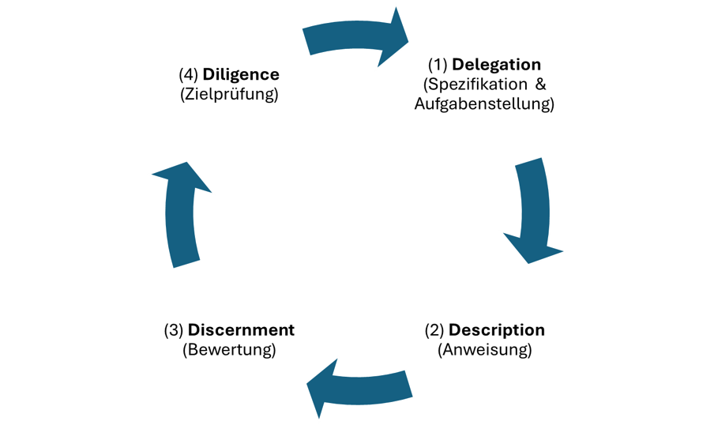
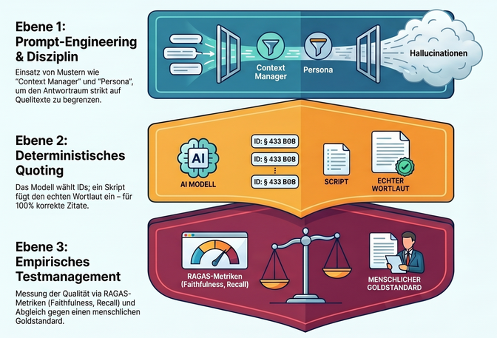
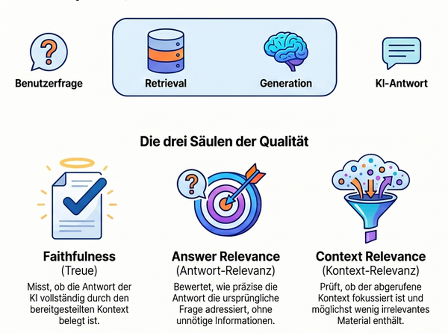
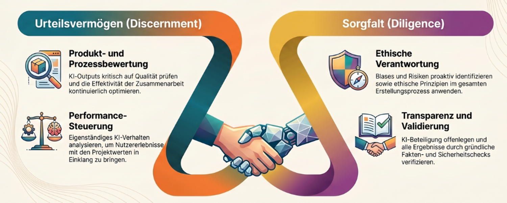

::: th-color-bar
:::

## Lernziele

::: lernziel-box
#### Was Sie nach diesem Workshop können

- **Delegate** — entscheiden, welche Prüfung Sie einem Skript, welche einem Modell und welche nur sich selbst überlassen.
- **Describe** — einen Suchprompt so bauen, dass seine Antworten prüfbar werden: Quellenbindung, Zitat-IDs, festes Format.
- **Discern** — einen GenAI-Output auf vier Ebenen testen (Prompt-Patterns, Prüfskript, LLM-Juror, Goldstandard) und sagen, welchen Fehler jede Ebene findet und welchen nicht.
- **Diligence** — für einen durchgerutschten Fehler die Verantwortung zuordnen und eine eigene Wenn-Dann-Schutzregel daraus ableiten.
:::

## Vorbereitung

- **Zugang** zu einem RAG-System mit Datei-Upload prüfen (GWDG Academic Cloud RAG/Arcana, NotebookLM, ChatGPT oder Claude mit Upload) — siehe [Quickstart](../appendix/quickstart.qmd).
- Den [HGB-Auszug](../data/hgb-auszug-pruefungspflicht.txt){target="_blank"} (§§ 264, 264d, 267, 267a, 316) herunterladen; er wird in Übung 7 in das RAG-System hochgeladen.
- Zwei eigene Dokumente als PDF bereitlegen: die **Prüfungsordnung** (Übung 5) und das **Modulhandbuch** oder ein anderes Dokument aus dem Studienalltag (Übung 4, Recap Describe).
- **Zugang zur DigiBib** mit der TH-Kennung testen ([Fachgebiet Wirtschaft](https://thb-koeln.digibib.net/eres/subject-area/Wirtschaft?defaults=on){target="_blank"} → Business Source Premier) und ein Werkzeug mit Deep-Research-Modus bereithalten (ChatGPT, Gemini oder Perplexity) — beides für Übung 1 und 2.
- Optional: die [Wissensbasis](../appendix/wissensbasis.qmd) zu RAG, RAGAS, Goldstandard und Prompt-Patterns überfliegen.

## Inhalte des Workshops

:::: week-card
::: card-header
🟦 Block 0 — Recap: Wo stehen wir im 4D-Kreis?
· 15 Min
:::

Der rote Faden beider Tage ist das **AI-Fluency-Framework** nach @dakan2025framework mit seinen vier Kompetenzen.
Tag 1 hat **Delegate** und **Describe** behandelt und mit der Test-Suite einen ersten Schritt in **Discern** gemacht.
Heute steht Discern im Mittelpunkt — die verschiedenen Möglichkeiten, die Qualität eines GenAI-Outputs zu testen — und am Ende schließt **Diligence** den Kreis: Wer trägt die Verantwortung für das, was keine Prüfung gefunden hat?

{fig-align="center" width="70%" fig-alt="Kreislauf aus vier Stationen mit Pfeilen: (1) Delegation — Spezifikation und Aufgabenstellung, (2) Description — Anweisung, (3) Discernment — Bewertung, (4) Diligence — Zielprüfung"}

Was ist aus Workshop 1 hängen geblieben?
Zwei Einstiege im Browser — ohne Konto, ohne Installation.

**Begriffs-Memory (5 Min, Einzel oder zu zweit).** Begriffe aus Workshop 1 ihren Definitionen zuordnen: fünf Paare pro Runde, zwei Minuten Zeit, sechs Runden von *LLM* und *Token* bis *Faithfulness* und *Diligence*.
Runde 1 enthält die Grundbegriffe, danach wird gemischt.
Wer nach zwei Runden aufhört, hat den Kern; wer alle sechs spielt, hat das Vokabular des Tages.
In neuem Tab öffnen: [Begriffs-Memory — LLM-Grundbegriffe](../interactions/begriffs-memory.html){target="_blank"} (am besten am Computer spielen).

<iframe src="../interactions/begriffs-memory.html" width="100%" height="760" style="border:1px solid #e6e6ea;" title="Begriffs-Memory — LLM-Grundbegriffe">

</iframe>

**Recap-Quiz (6 Min, Plenum).** Zwölf Multiple-Choice-Fragen zu den Kernpunkten von gestern — Process vs. Cognitive Automation, die vier D, die drei Konfigurationen, Harness und Jagged Frontier, RTF und CREATE, RAG, Faithfulness, Red-Green-TDD und als Brückenfrage die Haftung.
Am Beamer zeigen, per Handzeichen abstimmen, auflösen; jede Auflösung nennt die Fundstelle im Skript.
Zum Selbstdurchlauf: [Recap-Quiz — Workshop 1](../interactions/recap-quiz-w1.html){target="_blank"}.

Einstieg in die Qualitätsprüfung von "Discern": Welche Themen bei Ihrem gestrigen Tutor-Bot müssten auf jeden Fall geprüft werden?

➡️ [Übung 1 — Benchmarking per Deep Research](04-uebungen-w2-2026-ws.qmd#sec-deep-research-benchmark){.assignment-badge} · 6 Min · Delegate · Discern
➡️ [Übung 2 — Suchstrategie-1-Pager für Business Source Premier](04-uebungen-w2-2026-ws.qmd#sec-suchstrategie-bsp){.assignment-badge} · 9 Min · Describe · Discern
➡️ [Übung 3 — Prozessmodellierung mit Mermaid (Recap Delegate)](04-uebungen-w2-2026-ws.qmd#sec-mermaid){.assignment-badge} · 18 Min · Delegate
➡️ [Übung 4 — Prompt-Patterns am Studienalltag (Recap Describe)](04-uebungen-w2-2026-ws.qmd#sec-prompt-patterns-recap){.assignment-badge} · 12 Min · Describe
::::

:::: week-card
::: card-header
🟦 Block 1 — Qualitätssicherung von GenAI-Outputs in vier Ebenen · 20 Min
:::

Qualitätssicherung von GenAI-Outputs folgt dem Prinzip *Defense in Depth* — keine einzelne Maßnahme genügt, die Schichten fangen jeweils andere Fehlerklassen ab [@reason2000human].
Vier Ebenen greifen ineinander; die Abbildung fasst die Ebenen 3 und 4 als „Testmanagement" zusammen, die Übungen trennen sie, weil sie verschiedene Fehler finden.

{fig-align="center" width="70%" fig-alt="Vier hintereinander stehende Käsescheiben mit Löchern; ein roter Pfeil von „Hazards" rechts oben zu „Losses" links unten trifft in jeder Scheibe genau ein Loch und kommt so durch alle Schichten"}

Im 4D-Framework heißt diese Kompetenz **Discern**, und sie hat drei Facetten [@dakan2025framework].
*Product Discernment* fragt, ob der einzelne Output stimmt — das prüfen die Ebenen 1 und 2.
*Process Discernment* fragt, wie das Modell zu seiner Antwort gekommen ist — die Fact Check List in Ebene 1 und der Juror in Ebene 3 legen das offen.
*Performance Discernment* fragt, wie verlässlich das System über viele Anfragen arbeitet — die Domäne von RAGAS und Goldstandard.
Der Workshop geht die vier Ebenen von innen nach außen durch, vom einzelnen Prompt bis zum Test des ganzen Systems.

{fig-alt="Schichtendarstellung der drei Qualitätsprüfungs-Ebenen: Prompt-Engineering als innerste Schicht, deterministische Prüfung in der Mitte, Goldstandard-Tests als äußere Schicht"}

**Ebene 1 — Prompt-Engineering** diszipliniert das Modell innerhalb seiner Antwort.
Konkret nach @white2023prompt sechs Patterns aus dem Prompt-Pattern-Katalog: **Context Manager** begrenzt den Antwortraum auf den zentralen Textinhalt (**R**AG) und verbietet Rückgriff auf Trainingswissen.
**Persona** weist dem Modell die Rolle eines wortgetreuen Textanalysten ohne Entscheidungskompetenz zu.
**Template** erzwingt eine feste Ausgabestruktur (Sachverhalt → einschlägige Stellen → Auslegungsoptionen → Grenzen → Fact Check → Selbstprüfung).
**Fact Check List** zwingt das Modell, am Ende offenzulegen, welche Aussagen Folgerungen sind und gegengeprüft werden müssen.
**Reflection** instruiert zur Selbstprüfung vor Abgabe.
**Alternative Approaches** verlangt mehrere Auslegungsoptionen statt einer Entscheidung.
Diese Schicht senkt Halluzinationen, kontrolliert aber nicht den Wortlaut der zitierten Stellen.

**Ebene 2 — Deterministische Prüfung** nimmt dem Modell den Stift aus der Hand.
*Deterministic Quoting* nach @yeung2024deterministic trennt die Aufgabe „richtige Stelle auswählen" (Sprachmodell) von „Wortlaut wiedergeben" (deterministisches Skript).
Das Modell markiert Zitate mit kanonischen IDs (z. B. `HGB-§267-Abs1-Satz1`); ein nachgeschaltetes Skript schlägt den echten Wortlaut im Index nach und überschreibt den vom Modell gelieferten Text.
Existiert die ID nicht im Index, ist sie halluziniert.
Yeung berichtet für den so geprüften Bereich *zero false positives*.

**Ebene 3 — Automatische Prüfung** misst die statistische Qualität des Systems über viele Antworten.
Ein einfaches und weitgehend automatisiertes Werkzeug dafür: **RAGAS** [@es2024ragas] mit vier Kernmetriken — *Faithfulness* (passt die Antwort zu den Quellen?), *Answer Relevance* (beantwortet sie die Frage?), *Context Precision* (sind die relevanten Chunks weit oben?), *Context Recall* (wurden alle relevanten Chunks gefunden?).
Wichtige Warnung: die Faithfulness-Bewertung selbst wird von einem Sprachmodell vorgenommen, und Sprachmodelle erkennen Fehler in Modellantworten nur mit niedrigem Recall — sie übersehen einen erheblichen Teil und bleiben deutlich hinter menschlichen Prüfern zurück [@kamoi2024realmistake].
RAGAS taugt für *Grobeinschätzung der Qualität* und *relative Bewertung* (wird mein System schlechter, wenn ich das Modell oder den Prompt ändere?), nicht für absolute Zertifizierung.
Diese Ebene sieht, ob eine Antwort *zum Kontext* passt — nicht, ob sie *zur Frage* passt.

**Ebene 4 — Goldstandard** schließt genau diese Lücke.
Ein manuell kuratierter Goldstandard ist eine Sammlung typischer Berufsfragen mit expertengeprüften Soll-Fundstellen und Soll-Antworten, gegen die das System regelmäßig läuft.
Nur er findet den Fehler „richtiges Zitat, falsche Norm" — ein Zitat, das wörtlich stimmt und im Kontext steht, aber nicht die Stelle ist, die die Frage verlangt. Der Goldstandard ist die einzige Stelle, an der menschliche Fachurteile in den Prüfkreislauf eintreten, und er braucht deshalb selbst eine Qualitätsregel: Was zählt als korrekt, und wer entscheidet bei Dissens?

{fig-alt="Schematische Darstellung der vier RAGAS-Kernmetriken Faithfulness, Answer Relevance, Context Precision und Context Recall im Kontext eines Goldstandard-Testsets"}

**Exkurs — Skills: Ebene 2 als wiederverwendbares Paket.**
Ein *Skill* ist ein Ordner mit einer Anleitung (`SKILL.md`) und, wo nötig, Skripten und Referenzmaterial, den ein Modell bei Bedarf lädt — wie eine Arbeitsanweisung im Kanzlei-Handbuch, die eine Mitarbeiterin erst aufschlägt, wenn der passende Fall auf dem Tisch liegt [@zhang2025skills].
Das Modell sieht zunächst nur Name und Kurzbeschreibung aller verfügbaren Skills; die vollständige Anleitung und die Skripte kommen erst in den Kontext, wenn die Aufgabe dazu passt (*progressive disclosure*).
Ein Beispiel aus dem Finanzbereich: der Skill [*Analyzing Financial Statements*](https://github.com/danedane/anthropic_skills/blob/main/skills/analyzing-financial-statements/SKILL.md){target="_blank"} berechnet aus Bilanz- und GuV-Daten Kennzahlen zu Rentabilität, Liquidität, Verschuldung, Effizienz und Bewertung.
Entscheidend ist die Arbeitsteilung darin: Das Modell liest die Daten ein, wählt die passenden Kennzahlen aus und ordnet die Ergebnisse ein — die Zahlen selbst rechnet ein Python-Skript (`calculate_ratios.py`), nicht das Modell.
Das ist Ebene 2 in Reinform: Wo ein deterministisches Skript rechnet, gibt es keine „plausible, aber falsche" Kennzahl aus dem Sprachmodell mehr; was bleibt, ist prüfbar — stimmen die Eingabedaten, und steht im Skript die richtige Formel?
Was *Deterministic Quoting* für den Wortlaut leistet, leistet der Skill für die Arithmetik.
Für die Interpretation der Kennzahlen (`interpret_ratios.py` liefert Lesehilfen und Branchenvergleiche) gelten dagegen wieder Ebene 1 und Ebene 4: Das Urteil bleibt beim Menschen.
Verzeichnisse, in denen Sie fertige Skills finden und im Klartext lesen können: das offizielle Repository [anthropics/skills](https://github.com/anthropics/skills){target="_blank"} mit Spezifikation und Vorlage, das Verzeichnis [skills.sh](https://www.skills.sh/){target="_blank"} und die kuratierte Sammlung [awesome-agent-skills](https://github.com/VoltAgent/awesome-agent-skills){target="_blank"}.
Lesen Sie die nächste `SKILL.md` mit einer Frage: Welche Schritte erledigt ein Skript, welche das Modell — und wer prüft die Grenze dazwischen?

Vertiefung in der [Wissensbasis · Primer Qualitätsprüfung](../appendix/wissensbasis.qmd#sec-primer-qualitaetspruefung) und [Primer Goldstandard](../appendix/wissensbasis.qmd#sec-primer-goldstandard).
Pattern-Details unter [Prompt-Pattern-Katalog](../appendix/wissensbasis.qmd#sec-prompt-patterns).

➡️ [Übung 5 — Prüfungsordnung mit zweistufigem Dialog-Prompt](04-uebungen-w2-2026-ws.qmd#sec-pruefungsordnung){.assignment-badge} · 30 Min
➡️ [Übung 6 — RAGAS-Metriken mit Tutor-Bot verstehen](04-uebungen-w2-2026-ws.qmd#sec-ragas-tutor){.assignment-badge} · 15 Min
➡️ [Übung 7 — RAG-Suchübung HGB-Prüfungspflicht](04-uebungen-w2-2026-ws.qmd#sec-rag-hgb){.assignment-badge} · 30 Min (Kurzvariante; lang: 45 Min)
::::

:::: week-card
::: card-header
🟧 Block 2 — Diligence: Verantwortung für den durchgerutschten Fehler · 15 Min
:::

Die HGB-Suchübung endet mit einer Fundstelle, die das Modell vermutlich übersehen hat — und womöglich mit einer, die wörtlich stimmt und trotzdem nicht die Stelle ist, die die Frage verlangt.
Dass so etwas überhaupt jemand findet, hängt an einem Menschen, der die Antwort gegen einen Goldstandard hält — und daran, wer sich für sie verantwortlich fühlt.
Genau das ist **Diligence**, die vierte Kompetenz des 4D-Frameworks: Die Output-Prüfung am Tisch wird im Berufsalltag zur dokumentierten Verantwortung.

{fig-alt="Schematische Darstellung des Übergangs von der einzelnen Output-Prüfung (Discern) zur systematischen, dokumentierten Verantwortungsübernahme (Diligence)"}

Drei Säulen [@dakan2025framework]:

**Creation Diligence — verantwortlicher Umgang während der Erzeugung.** Verantwortungsvoller Umgang mit KI-Tools unter Einhaltung ethischer und rechtlicher Best Practices; Bewusstsein für Verzerrungen, Mängel, Auswirkungen auf Interessengruppen; Fähigkeit, Verzerrungen und ethische Risiken in KI-generierten Inhalten zu erkennen und zu mindern.
*Ziel:* Gewährleistung eines verantwortungsvollen und sozialbewussten Einsatzes von KI.

**Transparency Diligence — Offenlegung gegenüber Stakeholdern.** Transparenz und Verantwortlichkeit bei der Verbreitung des Endprodukts; Verständnis für die Erwartungen und Normen des Publikums, der Branche und der Rechtsordnung; Fähigkeit, die Art der KI-Beteiligung klar zu kommunizieren.
*Ziel:* Wahrung von Vertrauen und Integrität.
EU AI Act Art. 50 setzt seit 2025 explizite Transparenzpflichten für generative Outputs.

**Deployment Diligence — Verantwortung für Verifikation und Veröffentlichung.** Verantwortung für die Verifikation von KI-Outputs übernehmen, einschließlich gründlicher Faktenprüfung; angemessene Sicherheitsprüfungen vor der Freigabe; Risiken und Auswirkungen veröffentlichter KI-Inhalte verstehen und verantworten.
*Ziel:* Sicherstellung von Qualität, Sicherheit und Verlässlichkeit.
Im Berufsstand übersetzt: Wer haftet, wenn der KI-Output Schaden anrichtet?
Antwort: immer Sie als Berufsträger:in, nie der Anbieter.

Berufsrechtlicher Rahmen für Tax/Audit/Advisory:

- **WPO § 43** — Berufsgrundsätze für Wirtschaftsprüfer: Eigenverantwortlichkeit, Gewissenhaftigkeit, Verschwiegenheit, Unabhängigkeit.
- **StBerG § 57** — gleichgelagerte Pflichten für Steuerberater. Verschwiegenheit ist eine Berufspflicht, kein Vertragsthema; ihre Verletzung ist Straftat nach § 203 StGB.
- **DSGVO Art. 5** — Datenschutz-Grundsätze, insbesondere *Zweckbindung* und *Datenminimierung*. Free-Tier-Anbieter trainieren in der Regel auf Eingaben — damit ist Mandantenbezug ausgeschlossen.

➡️ [Übung 8 — Diligence-Risiko-Recherche im Best-of-N](04-uebungen-w2-2026-ws.qmd#sec-diligence-bestof-n){.assignment-badge}
· 22 Min (15 Min Übung + 4 Min TPS + 3 Min Plenum)
::::

## Diskussionsfragen

- Welche der vier Prüfebenen ist in Ihrem Berufsfeld am ehesten praktisch umsetzbar — Prompt-Engineering, Deterministic Quoting, RAGAS oder ein Goldstandard? Und welche wäre die erste, die Sie morgen aufbauen würden?
- Ein Zitat ist wörtlich korrekt, vom Skript verifiziert und vom Juror gestützt — und trotzdem die falsche Stelle. Wer im Team merkt das, und wann? <!-- - An welcher Stelle Ihres BPMN-Modells wäre *Cognitive Automation* sinnvoller als *Process Automation*? -->
- Welche Diligence-Pflicht aus WPO § 43, StBerG § 57 oder DSGVO Art. 5 wird in Ihrer typischen KI-Nutzung am ehesten verletzt — und an welcher Stelle des Workflows?
- Wie würden Sie *Transparency Diligence* in der Mandantenkommunikation dokumentieren, ohne den Mandanten zu verunsichern?

## Aufgaben

::: callout-note
## Zwei Recherche-Übungen, zwei Recaps, drei Discern-Übungen, eine Diligence-Übung

**Recherche zum Einstieg (Block 0, 15 Min):** [Übung 1 — Benchmarking per Deep Research](04-uebungen-w2-2026-ws.qmd#sec-deep-research-benchmark){.assignment-badge} [Übung 2 — Suchstrategie-1-Pager für Business Source Premier](04-uebungen-w2-2026-ws.qmd#sec-suchstrategie-bsp){.assignment-badge}

**Recaps zu Tag 1 (in Block 0):** [Übung 3 — Prozessmodellierung mit Mermaid (Recap Delegate)](04-uebungen-w2-2026-ws.qmd#sec-mermaid){.assignment-badge} [Übung 4 — Prompt-Patterns am Studienalltag (Recap Describe)](04-uebungen-w2-2026-ws.qmd#sec-prompt-patterns-recap){.assignment-badge}

**Discern (nach Block 1):** [Übung 5 — Prüfungsordnung mit zweistufigem Dialog-Prompt](04-uebungen-w2-2026-ws.qmd#sec-pruefungsordnung){.assignment-badge} [Übung 6 — RAGAS-Metriken mit Tutor-Bot verstehen](04-uebungen-w2-2026-ws.qmd#sec-ragas-tutor){.assignment-badge} [Übung 7 — RAG-Suchübung HGB-Prüfungspflicht](04-uebungen-w2-2026-ws.qmd#sec-rag-hgb){.assignment-badge}

**Diligence (nach Block 2):** [Übung 8 — Diligence-Risiko-Recherche im Best-of-N](04-uebungen-w2-2026-ws.qmd#sec-diligence-bestof-n){.assignment-badge}

**Hausaufgabe bis zur In-Company-Session:** [BPMN-Modellierung in Signavio](04-uebungen-w2-2026-ws.qmd#sec-bpmn){.assignment-badge} [Deep-Research-Bericht gegen die Evidenz halten](04-uebungen-w2-2026-ws.qmd#sec-deep-research-check){.assignment-badge}

Zwei Recherche-Übungen eröffnen den Tag an seiner Leitfrage — wie Arbeitsprozesse in Tax, Audit & Advisory automatisiert und mit generativer KI unterstützt werden und was die Forschung dazu belegt: Übung 1 delegiert das Praxis-Benchmarking an einen Deep-Research-Lauf und legt vorab den Prüfmaßstab fest, Übung 2 baut dieselbe Frage als dokumentierte Suchstrategie in Business Source Premier mit Peer-Review-Limiter und VHB-Journalfilter.
Die Recaps holen Delegate und Describe von gestern in zwei kurzen Übungen zurück: ein Prozessdiagramm mit *P/C/H/M*-Markierung und ein Alltagsprompt, umgebaut mit den Patterns nach White et al. (2023) — denselben sechs, die Block 1 als Ebene 1 der Qualitätsprüfung einführt.
Übung 5 wendet die Patterns an der eigenen Prüfungsordnung an und prüft den Output gegen ein Protokoll; Übung 6 erklärt die RAGAS-Metriken sokratisch; Übung 7 hegt ein RAG-System im HGB auf die Rolle der reinen Suchhilfe ein.
Übung 8 generiert aus einer Diligence-Definition Risikofälle im Best-of-N und leitet eine Wenn-Dann-Schutzregel ab — der Übergang von Discern zu **Diligence** und das Saatkorn für die eigene Personal AI Policy.
:::

## Hintergrund / Werkzeuge / Ressourcen

- **Wissensbasis** — [Prompt-Pattern-Katalog nach White](../appendix/wissensbasis.qmd#sec-prompt-patterns) · [RAG-Grundlagen](../appendix/wissensbasis.qmd#sec-rag) · [Primer Qualitätsprüfung](../appendix/wissensbasis.qmd#sec-primer-qualitaetspruefung) · [Primer Goldstandard](../appendix/wissensbasis.qmd#sec-primer-goldstandard) · [Recht und Berufsstand](../appendix/wissensbasis.qmd#sec-recht).
- **Material und Werkzeuge der Übungen** — [HGB-Auszug](../data/hgb-auszug-pruefungspflicht.txt){target="_blank"} (§§ 264, 264d, 267, 267a, 316) · [Mermaid Live Editor](https://mermaid.live){target="_blank"} · [Signavio Academic Edition](https://academic.signavio.com/p/explorer){target="_blank"} / [bpmn.io](https://bpmn.io){target="_blank"} · [Mermaid-Prozessdiagramme mit KI](../appendix/wissensbasis.qmd#sec-mermaid-ki) · [BPMN-Grundlagen](../appendix/wissensbasis.qmd#sec-bpmn).
- **Skills** — [Agent-Skills-Spezifikation und Beispiele (anthropics/skills)](https://github.com/anthropics/skills){target="_blank"} · [skills.sh — Verzeichnis](https://www.skills.sh/){target="_blank"} · [awesome-agent-skills — kuratierte Sammlung](https://github.com/VoltAgent/awesome-agent-skills){target="_blank"} · Beispiel [Analyzing Financial Statements](https://github.com/danedane/anthropic_skills/blob/main/skills/analyzing-financial-statements/SKILL.md){target="_blank"} (Kennzahlen per Python-Skript — Ebene 2) · Hintergrund: @zhang2025skills.
- **Originalmaterial** — Cheat Sheet und Practical Overview zu Diligence aus @dakan2025framework.

```{=html}
<!-- Auskommentiert am 24.09.2026 (BPMN/RPA):
- [BPMN-Grundlagen](../appendix/wissensbasis.qmd#sec-bpmn) · [RPA-Grundlagen](../appendix/wissensbasis.qmd#sec-rpa)
- **Standardreferenz BPMN** — @omg2014bpmn.
- **Service-Automation-Continuum** — @lacity2021becoming und @willcocks2024evolution als Vertiefung zur strategischen Einordnung.
-->
```

## Weiterführend

- @white2023prompt — *A Prompt Pattern Catalog to Enhance Prompt Engineering with ChatGPT* (Originalpaper zu den 16 Patterns).
- @yeung2024deterministic — *Deterministic Quoting* als praktisches Verfahren gegen Zitat-Halluzinationen.
- @es2024ragas — *RAGAS: Automated Evaluation of Retrieval Augmented Generation*.
- @magesh2025hallucination — empirische Studie zu Halluzinationsraten in juristischen RAG-Systemen.
- @rajpurkar2018squad2 — *Know What You Don't Know* — das SQuAD-2.0-Prinzip unbeantwortbarer Fragen, nach dem Item 8 des Goldstandards gebaut ist. <!-- - @lacity2016new · @coombs2020strategic · @davenport2018artificial — drei klassische Texte zur Service-Automatisierung und intelligenter Automation in Wissensarbeit. -->

## Tutor

::: callout-tip
## Tutor öffnen

[Tutor — KI in Tax, Audit & Advisory →](https://chatgpt.com/g/g-6a03076b4da88191b9e9ae9580a0c2ce-ki-tutor-fur-workshop-auditing-tax-advisory){target="_blank"}

Vorschlag-Prompt für diesen Workshop:

> Ich arbeite in Workshop 2 am Block *Qualitätssicherung von GenAI-Outputs*.
> Erklären Sie mir am Beispiel eines HGB-RAG-Systems, wie die vier Ebenen (Prompt-Engineering nach White, Deterministic Quoting nach Yeung, automatische Prüfung mit RAGAS, manuell kuratierter Goldstandard) ineinandergreifen — und welchen Fehler jede Ebene findet, den die anderen nicht sehen.
> Welche Ebene würden Sie zuerst aufbauen, wenn ich morgen anfangen müsste — und warum?
:::

## Referenzen

::: {#refs}
:::
