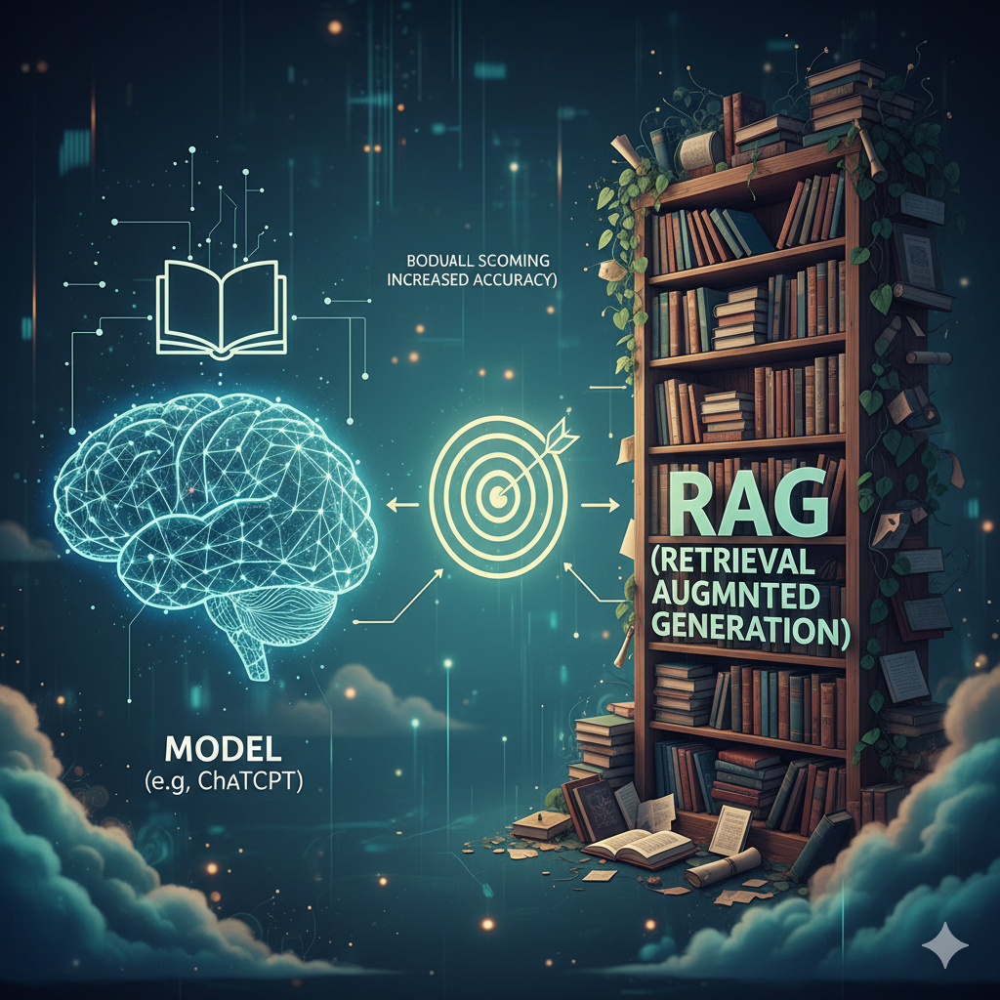

::: th-color-bar
:::

::: lernziel-box
#### Was Sie in dieser Wissensbasis finden

- Kompakte Nachschlage-Sektionen zu allen Themen, die in den Workshops 1 und 2 verwendet werden,
- Lay-Erklärung jedes Fachbegriffs **vor** dem technischen Detail,
- Verweise auf die Originalliteratur und zu den passenden Workshop-Stellen.
:::

Diese Seite ist absichtlich als ein einziges, durchsuchbares Dokument angelegt. Stand: 12.05.2026.

## AI Fluency Framework — die vier Kompetenzen im Überblick {#sec-4d-framework}

Die folgenden Definitionen folgen dem *Framework for AI Fluency — Practical Overview Document, Version 1.1* von @dakan2025framework. Übersetzung aus dem englischen Original. Lizenz des Originals: CC BY-NC-ND 4.0.

::: callout-note
## Was ist AI Fluency?

**AI Fluency** ist die Fähigkeit, **effektiv**, **effizient**, **ethisch** und **sicher** innerhalb der entstehenden Modalitäten der Mensch-KI-Interaktion zu arbeiten [@dakan2025framework]. Das Framework benennt vier vernetzte Kernkompetenzen — die *4 Ds* — sowie drei Modalitäten, in denen Mensch und KI zusammenwirken.
:::

### Drei Modalitäten der Mensch-KI-Interaktion

**Modalität 1 — Automation (KI führt eine vom Menschen definierte Aufgabe aus).** KI erledigt Aufgaben eigenständig, aber auf der Grundlage direkter menschlicher Anweisungen (etwa als Antwort auf einen Prompt). Besonders geeignet für repetitive, zeitintensive oder datenintensive Aufgaben. Erfordert klare Aufgabendefinition und Qualitätskontrolle. Beispiele: E-Mails, Zusammenfassungen, Social-Media-Posts, einfaches Coding.

**Modalität 2 — Augmentation (KI und Mensch erledigen die Aufgabe gemeinsam).** KI und Mensch definieren und führen Aufgaben iterativ gemeinsam aus und arbeiten kollaborativ auf ein Endziel hin. Schwerpunkt liegt auf der Stärkung menschlicher Kreativität durch einen KI-Denkpartner, nicht auf Ersetzung. Beispiele: Geschichten und Essays schreiben, Forschungsarbeiten, komplexes Coding.

**Modalität 3 — Agency (Mensch konfiguriert KI für eigenständige zukünftige Tätigkeiten).** Der Mensch konfiguriert die KI, damit sie zukünftige Aufgaben — auch für andere Nutzer:innen — selbstständig erledigt. Diese Modalität definiert nicht eine konkrete Aufgabe, sondern Eigenschaften und Verhalten einer KI. Erfordert ein tiefes Verständnis von Fähigkeiten und Grenzen. Beispiele: interaktive Spielcharaktere, Tutoren, Chatbots.

Mensch-KI-Interaktionen überbrücken häufig mehrere Modalitäten gleichzeitig; in der Praxis wechseln Anwendende selbst innerhalb eines Projekts zwischen ihnen.

### Delegation — Schaffende Vision und Auswahl der richtigen KI-Werkzeuge

Delegation bezeichnet die Fähigkeit zu erkennen, *wann* und *wie* KI-Werkzeuge und -Modalitäten in kreativen und problemlösenden Prozessen wirksam eingesetzt werden. Sie umfasst das Verständnis der Möglichkeiten und Grenzen verschiedener KI-Technologien und das informierte Entscheiden, wann KI für Automation, Augmentation oder Agency genutzt wird.

**Ziel- und Aufgabenbewusstsein (Goal and Task Awareness).**

- Eine wirksame Zielvorstellung für ein Projekt entwerfen.
- Die Natur und die Anforderungen der Aufgabe(n) auf dem Weg zum definierten Ziel verstehen.
- Eine Aufgabe in KI-, Mensch- und kollaborative Anteile analysieren und zerlegen können.
- Voraussetzung für die effektive Integration von KI in kreative Arbeitsabläufe.

**Plattformbewusstsein (Platform Awareness).**

- Möglichkeiten und Grenzen aktueller KI-Werkzeuge kennen.
- Verschiedene KI-Plattformen und ihre spezifischen Stärken und Grenzen mit Blick auf das Projektziel kennen.
- KI-Werkzeuge nach Projektanforderungen, Budget, operativen und regulatorischen Bedürfnissen bewerten können.
- Voraussetzung für die Auswahl der optimalen KI-Werkzeuge für spezifische Aufgaben.

**Aufgabendelegation (Task Delegation).**

- KI- und menschliche Fähigkeiten so ausbalancieren, dass die kreative Vision optimal umgesetzt wird.
- Die Eigenschaften der drei Modalitäten (Automation, Augmentation, Agency) verstehen.
- Projektaufgaben optimal an Mensch und KI-Werkzeuge vergeben können.
- Voraussetzung für die erfolgreiche Zusammenarbeit zwischen Mensch und KI in kreativen Prozessen.

### Description — Vision und Aufgaben so beschreiben, dass nützliche KI-Verhaltensweisen entstehen

Description umfasst die Fähigkeiten, Ideen, Anforderungen, Constraints und andere Aspekte kreativer Vorstellungen wirksam an KI-Systeme zu kommunizieren. Sie beinhaltet das Verfassen klarer, präziser und gut strukturierter Prompts (mit einem breiten Repertoire an Prompting-Techniken) und weiterer Elemente, die KI-Werkzeuge zu gewünschten Verhaltensweisen und Ergebnissen führen.

**Produktbeschreibung (Product Description).**

- Prompten, um das gewünschte Ergebnis zu definieren.
- Gewünschte Eigenschaften, Merkmale und Qualitäten des finalen KI-generierten Outputs klar artikulieren können.
- Eine kreative Vision in explizite, KI-verständliche Begriffe übersetzen können.
- Zentral, um KI-Werkzeuge zu Ergebnissen zu führen, die mit den Absichten der Schaffenden übereinstimmen.

**Prozessbeschreibung (Process Description).**

- Dialogisches Prompten für effektive iterative Zusammenarbeit.
- In einen dynamischen Hin-und-Her-Austausch mit KI-Werkzeugen treten können.
- Komplexe Aufgaben in eine Reihe kleinerer, handhabbarer Prompts zerlegen können.
- Wesentlich, um KI durch mehrstufige kreative Prozesse zu führen, im Einklang mit den menschlichen Mitwirkenden.

**Verhaltensbeschreibung (Performance Description).**

- Anweisendes Prompten, das zukünftige KI-Verhaltensweisen festlegt und ein positives Nutzungserlebnis ermöglicht.
- Definieren können, wie KI-erzeugte Inhalte oder Systeme sich verhalten oder mit der Welt interagieren sollen.
- Nutzungsbedürfnisse antizipieren und in Leitlinien für KI-Verhalten übersetzen können.
- Entscheidend, um zukünftige agentische KI-Verhaltensweisen zu ermöglichen, die mit Werten und Vorstellungen des Menschen übereinstimmen.

### Discernment — Treffende Beurteilung des Nutzens von KI-Ergebnissen

Discernment umfasst die kritische Beurteilung KI-generierter Outputs hinsichtlich Qualität, Relevanz, möglicher Verzerrungen und weiterer wesentlicher Merkmale. Dazu gehört auch die Fähigkeit, den Kollaborationsprozess mit KI-Werkzeugen zu iterieren und zu verfeinern.

**Produkt-Beurteilung (Product Discernment).**

- Output-Qualität bewerten und Verbesserungsmöglichkeiten identifizieren.
- Qualität, Relevanz und Wirksamkeit KI-generierter Inhalte kritisch beurteilen können.
- Stärken und Schwächen in KI-Outputs erkennen können.
- Zentral für das Aufrechterhalten hoher Standards in KI-gestützter kreativer Arbeit.

**Prozess-Beurteilung (Process Discernment).**

- Beurteilen, ob die Mensch-KI-Zusammenarbeit produktiv ist und wie sie verbessert werden kann.
- Die Wirksamkeit des Mensch-KI-Kooperationsprozesses evaluieren können.
- Erkennen, welche Aspekte der Mensch-KI-Interaktion am hilfreichsten sind und wo Verbesserungen möglich sind.
- Wesentlich für die Optimierung des KI-Einsatzes in kollaborativer kreativer Arbeit.

**Verhaltens-Beurteilung (Performance Discernment).**

- Beurteilen, ob eigenständige KI-Verhaltensweisen ein positives Nutzungserlebnis ermöglichen, und wie die KI besser angeleitet werden kann.
- Die Wirksamkeit von KI-Systemen in unabhängigen, nutzerorientierten Szenarien beurteilen können.
- Nutzerfeedback erheben und interpretieren, um beabsichtigte KI-Verhaltensweisen und Erlebnisse zu verfeinern und sicherzustellen.
- Wesentlich für die Gestaltung von Nutzungserlebnissen, die mit den Werten und der Vision des Projekts übereinstimmen.

### Diligence — Verantwortung übernehmen und für KI-gestützte Endprodukte einstehen

Diligence bezeichnet den verantwortlichen Umgang mit KI, einschließlich ethischer Überlegungen, Transparenz über den KI-Einsatz und die Übernahme von Verantwortung für die mit KI-Unterstützung erstellten Endprodukte.

**Creation Diligence — verantwortlicher Umgang während der Erzeugung.**

- Verantwortungsvoller Umgang mit KI-Tools unter Einhaltung ethischer und rechtlicher Best Practices sowie Bewusstsein für Verzerrungen, Mängel, Auswirkungen auf Interessengruppen und andere externe Effekte.
- Verständnis und Anwendung ethischer Grundsätze während des gesamten KI-gestützten kreativen Prozesses.
- Fähigkeit, potenzielle Verzerrungen und ethische Risiken in KI-generierten Inhalten zu erkennen und zu mindern.
- Ziel: Gewährleistung eines verantwortungsvollen und sozialbewussten Einsatzes von KI.

**Transparency Diligence — Offenlegung gegenüber Stakeholdern.**

- Transparenz und Verantwortlichkeit bei der Verbreitung des Endprodukts.
- Verständnis für die Erwartungen und Normen des Publikums, der Branche und der Rechtsordnung in Bezug auf KI-generierte Inhalte.
- Fähigkeit, die Art der KI-Beteiligung am Prozess klar zu kommunizieren.
- Ziel: Wahrung von Vertrauen und Integrität bei der Verbreitung KI-gestützter Arbeiten.

**Deployment Diligence — Verantwortung für Verifikation und Veröffentlichung.**

- Verantwortung für die Verifikation von und das Einstehen für KI-gestützte Outputs übernehmen, einschließlich gründlicher Faktenprüfung, Test auf Korrektheit und Validierung von Aussagen.
- Angemessene Sicherheitsprüfungen und Testverfahren vor der Freigabe KI-gestützter Arbeit umsetzen.
- Verstehen, managen und Verantwortung übernehmen für potenzielle Risiken und Auswirkungen veröffentlichter KI-gestützter Inhalte oder Agenten.
- Ziel: Sicherstellung von Qualität, Sicherheit und Verlässlichkeit von Inhalten und Agenten, die durch Mensch-KI-Interaktion entstanden sind.

*Querverweise:* [Workshop 1, Block 2](01-workshop01.qmd) (Kurzdurchlauf der vier Kompetenzen) · [Workshop 2, Block K](03-workshop02.qmd) (Diligence vertieft) · [Übungen Workshop 1](02-uebungen-w1.qmd) (Anwendung von Delegation, Description, Discernment).

*Quelle:* Dakan, R. & Feller, J. (2025). *Framework for AI Fluency: Practical Overview Document* (V 1.1). CC BY-NC-ND 4.0. <https://ringling.libguides.com/ai/framework>

## LLM-Grundlagen {#sec-llm-grundlagen}

::: {.callout-note}
## Was ist ein LLM?

Ein **Large Language Model** ist ein **statistischer Textgenerator**, der das jeweils nächstwahrscheinliche Wort vorhersagt — nicht mehr und nicht weniger. *Bild:* sehr gut geübter Autovervollständiger, der zu einem Anfang den passenden Folgetext rät. *Technisch:* tiefes neuronales Netz mit Transformer-Architektur, trainiert auf großen Textmengen.
:::

Drei Kernunterscheidungen, die durchgehend in beiden Workshops auftauchen.

### Reasoning vs. Instant

**Instant-Modelle** antworten direkt; **Reasoning-Modelle** denken zwischen Frage und Antwort sichtbar oder unsichtbar nach (Chain-of-Thought). Reasoning lohnt sich bei Mehrschritt-Aufgaben, ist langsamer und teurer.

### Werkzeuge und Harness

**Harness** — der **Werkzeugring** um das LLM herum: Web-Search, Code-Interpreter, Datei-Upload, Memory, Tool-Calling. Die Antwortqualität hängt fast immer mehr vom Harness ab als vom Modell allein [@grootendorst2025visual].

{fig-alt="Symbolbild zur Tool-Metapher von LLM und Harness, bestehend aus Modell-Kern und einem Werkzeugkasten mit verschiedenen Funktionen"}

### Drei Lizenz-Tiers

**Free** (0 €): begrenzter Kontext, oft kein Web-Search, keine vertraulichen Daten. **Casual** (~20–30 €/Monat): Pro-Tier von Claude, ChatGPT, Gemini. **Professional** (~100–200 €/Monat): Team-/Enterprise-Tiers mit Datenschutzgarantien, längeren Kontexten, mehr Tools. *Faustregel:* Mandantenarbeit nicht im Free-Tier.

*Querverweise:* [Workshop 1, Block 3](01-workshop01.qmd) · [Übung 2](02-uebungen-w1.qmd#sec-uebung-2).

## Welches Modell? {#sec-welches-modell}

Schlanke Vergleichsseite analog zu @bekes2026ai. Stand der Empfehlungen: Mai 2026.

{fig-alt="Visualisierung eines Skill-Profils im Finanzbereich mit typischen Tätigkeitsfeldern als Vergleichsraster für KI-Modelle"}

*Querverweise:* [Workshop 1, Block 3](01-workshop01.qmd) · [Übung 2](02-uebungen-w1.qmd#sec-uebung-2).

## Prompt-Muster {#sec-prompt-muster}

Sieben Bausteine eines belastbaren Prompts: **Rolle · Zielgruppe · Aufgabe · Tonalität · Constraints · Format · Iteration**. Anker: @pmi2024talking.

### Iteration als Pflicht

Ein Prompt ist nie fertig. Drei Iterationen sind Mindeststandard, dokumentiert mit *was geändert · warum · Effekt auf den Output*.

*Querverweise:* [Übung 2](02-uebungen-w1.qmd#sec-uebung-2) · [Übung 3](02-uebungen-w1.qmd#sec-uebung-3).

## Tools und Plattformen {#sec-tools}

### Drei Tool-Klassen

**Chat-Plattformen** (Claude, ChatGPT, Gemini, Perplexity), **eingebettete Assistenten** (Copilot in Microsoft 365, Gemini in Google Workspace), **agentische Plattformen** (Custom GPTs, Claude Projects, Gems, Agents-Framework).

*Querverweise:* [Workshop 1, Block 3](01-workshop01.qmd) · [Übung 2](02-uebungen-w1.qmd#sec-uebung-2).

## BPMN-Grundlagen {#sec-bpmn}

::: {.callout-note}
## Was ist BPMN?

**Business Process Model and Notation** — eine **bildliche Sprache**, in der Geschäftsprozesse mit standardisierten Symbolen gezeichnet werden. *Bild:* eine Notensprache für Prozesse — dieselben Symbole bedeuten überall dasselbe. *Technisch:* OMG-Standard, derzeit Version 2.0.2 [@omg2014bpmn].
:::

### Wozu modellieren?

Ein BPMN-Modell beantwortet vier Fragen sichtbar: *Wer* macht *was* in welcher *Reihenfolge* mit welchem *Input und Output*. Solange diese vier Fragen unklar sind, lohnt sich keine Automatisierung — weder mit RPA noch mit KI. Modellieren ist also die Vorstufe zur Automatisierungsentscheidung, nicht ihr Ersatz. Wer ein Modell zeichnet, deckt typischerweise Unklarheiten auf, die im normalen Workflow toleriert wurden — Verantwortungslücken, doppelte Prüfungen, unklare Übergaben.

### Kernsymbole

**Aktivität** (abgerundetes Rechteck) — eine konkrete Tätigkeit, die jemand ausführt. **Ereignis** (Kreis) — etwas, das passiert: Prozess-Start, Zwischenereignis, Prozess-Ende. **Gateway** (Raute) — eine Verzweigung im Ablauf: exklusiv (XOR, „entweder–oder"), parallel (AND, „beides"), inklusiv (OR, „eines oder mehrere"). **Sequenzfluss** (Pfeil) — die Reihenfolge zwischen Aktivitäten. **Pool und Lane** (Schwimmbahn) — visualisieren Zuständigkeiten: ein Pool pro beteiligter Organisation, eine Lane pro Rolle innerhalb der Organisation.

### Lesen vor Zeichnen

Ein gutes BPMN-Modell ist auch ohne Erklärung verständlich. Vor dem ersten eigenen Modell empfiehlt sich, zwei bis drei Beispiele aus Lehrbüchern oder offiziellen BPMN-Galerien zu lesen. Wer fünf Standard-Symbole sicher unterscheidet, kann achtzig Prozent der praxisrelevanten Modelle entziffern.

### Modellieren in Signavio (Academic Edition)

Studierende der TH Köln nutzen [Signavio Academic Edition](https://academic.signavio.com/p/explorer) (kostenfrei mit Hochschul-E-Mail). Vorgehen: nach Login einen neuen Diagrammtyp *BPMN 2.0* anlegen, mit *Start-Ereignis* beginnen, *Aktivitäten* aus der Symbolpalette ziehen, mit *Sequenzflüssen* verbinden, *Pool* und *Lanes* nach Rollen aufsetzen, ein *XOR-Gateway* für die erste Entscheidung einbauen, mit einem *Ende-Ereignis* abschließen. Diagramm als PNG oder PDF exportieren. Wer Signavio nicht nutzen kann, weicht auf [bpmn.io](https://bpmn.io) aus — gleiches Symbol-Set, kleinerer Funktionsumfang.

### Prozessdenken vor Werkzeugwahl

Ein gutes BPMN-Modell zwingt zur Klärung *wer macht was wann mit welchem Input und welchem Output* — die Voraussetzung für jede sinnvolle Automatisierungsentscheidung. Erst nach dem Modell entscheidet sich, welche Aktivität sich für Process Automation (regelbasiertes RPA) und welche für Cognitive Automation (KI-gestützt) eignet.

*Querverweise:* [Workshop 2, Block I](03-workshop02.qmd) · [Übung BPMN-Modellierung](04-uebungen-w2.qmd#sec-bpmn).

## Retrieval-Augmented Generation (RAG) {#sec-rag}

::: {.callout-note}
## Was ist RAG?

**Retrieval-Augmented Generation** — eine **Mischtechnik**, bei der ein Sprachmodell vor der Antwort eigene Quellen nachschlägt, statt allein aus dem Trainingsdaten-Gedächtnis zu sprechen. *Bild:* statt aus dem Kopf zu antworten, schlägt das Modell zuerst in der Bibliothek nach. *Technisch:* die Eingabefrage wird semantisch durchsucht, passende Textstellen aus einer Dokumentensammlung werden ans Modell mitgegeben, das Modell antwortet auf Basis dieser Stellen [@es2024ragas].
:::

{fig-align="center" width="60%" fig-alt="Bildhafte Darstellung von Retrieval-Augmented Generation als Bücherregal, aus dem ein KI-Assistent vor der Antwort nachschlägt"}

### Drei Komponenten

**Wissensbasis** — die Dokumente, in denen gesucht werden soll: PDF-Sammlungen, Gesetzestexte, eigene Notizen, Mandantenakten (innerhalb der DSGVO-Grenzen). **Retriever** — die Suchmaschine: nimmt die Frage, sucht semantisch ähnliche Textstellen in der Wissensbasis, liefert die Top-Treffer. **Generator** — das Sprachmodell: bekommt die gefundenen Textstellen und die Frage zusammen, antwortet darauf.

### Wofür RAG geeignet ist

Frage zu einem Sachverhalt, der im Trainingsdatensatz fehlt oder veraltet ist. Frage, die eine Quelle braucht — Gesetzestext, BMF-Schreiben, internes Handbuch. Frage, bei der Halluzinationen besonders teuer wären — juristisch geprägte Fragen, Stellungnahmen mit Quellenpflicht. Frage, bei der dieselbe Wissensbasis von vielen genutzt werden soll — Tutor-Bots, Compliance-Helfer.

### Was RAG nicht löst

Halluzinationen verschwinden nicht ganz — sie verlagern sich. Das Modell kann immer noch Fundstellen falsch interpretieren, Aussagen aus dem Kontext reißen oder Quellen kombinieren, die zusammen nicht zueinander passen. Außerdem entstehen neue Fehlerquellen: Wurde die richtige Quelle abgerufen? Wurde sie überhaupt vollständig durchsucht? Hat das Embedding-Modell den Suchbegriff verstanden? Die vier RAGAS-Metriken — *Faithfulness*, *Answer Relevance*, *Context Precision*, *Context Recall* — adressieren genau diese Fehlerquellen [@es2024ragas].

### Wann RAG nicht hilft

Kreative Aufgaben ohne Quellenbedarf — RAG bringt nichts, wenn die Aufgabe ein offenes Brainstorming ist. Schließende Aufgaben, die eine Bewertung des Inhalts verlangen — RAG findet Textstellen, nicht juristische Subsumtionen (siehe HGB-Suchübung in Workshop 2). Echtzeitfragen ohne strukturiertes Wissen — Web-Search ist hier oft besser als RAG.

### Konkrete RAG-Werkzeuge im Workshop

**NotebookLM** ([notebooklm.google.com](https://notebooklm.google.com){target="_blank"}) — eigene PDFs hochladen, Modell antwortet quellenbasiert. **GWDG Academic Cloud RAG/Arcana** — Hochschul-Lösung mit Dokumentenupload und Modellauswahl. **Custom GPTs / Claude Projects** — Persistenter Bot mit eigener Knowledge Base. In Übung 3 (Workshop 1) und in der HGB-Suchübung (Workshop 2) probieren Sie das aus.

*Querverweise:* [Übung 3 Schritt c](02-uebungen-w1.qmd#sec-uebung-3) (RAG-Tutor mit NotebookLM) · [RAG-Suchübung HGB-Prüfungspflicht](04-uebungen-w2.qmd#sec-rag-hgb) · [Workshop 1, Block 5](01-workshop01.qmd) (Discern, RAGAS-Metriken).

## Mermaid-Prozessdiagramme mit KI erstellen {#sec-mermaid-ki}

::: callout-note
## Was ist Mermaid?

**Mermaid** ist eine **textbasierte Diagramm-Sprache**, in der Sie Flussdiagramme, Sequenzdiagramme und einfache BPMN-ähnliche Prozesse als wenige Zeilen Code schreiben und der Editor zeichnet sie automatisch. *Bild:* Notensprache für Diagramme — Sie tippen, das System zeichnet. *Technisch:* Open-Source-Notation, gerendert in JavaScript, eingebettet in Markdown, GitHub, Notion, Obsidian und Quarto. Live-Editor unter [mermaid.live](https://mermaid.live).
:::

### Warum Mermaid in der Prozessmodellierung?

Mermaid ist die niedrigste Einstiegshürde in Prozessdiagramme: keine Installation, keine Maus-Klickerei, sofortige visuelle Rückmeldung. Für ein erstes Modell, eine Skizze oder eine Brainstorm-Variante reicht Mermaid vollkommen. Wer von dort zu BPMN 2.0 in Signavio wechselt, hat den gedanklichen Aufwand bereits hinter sich — Aktivitäten, Entscheidungen, Reihenfolge — und arbeitet dort nur noch an Notationspräzision und Swimlanes.

### Mit KI gebaute Mermaid-Diagramme

Ein starkes Sprachmodell kann aus einer Prosabeschreibung einen passenden Mermaid-Code erzeugen. Der Workflow ist immer derselbe: Sie beschreiben den Prozess in zwei bis fünf Sätzen, geben die gewünschte Mermaid-Variante (Flowchart, Sequence, ER) vor, das Modell liefert Code, Sie kopieren ihn in [mermaid.live](https://mermaid.live){target="_blank"} und prüfen das Diagramm visuell.

**Prompt-Vorlage zum Kopieren.**

::: callout-tip
> Erstellen Sie mir ein **Mermaid-Flowchart** (`graph TD`, top-down) für den folgenden Prozess. Antworten Sie ausschließlich mit dem Mermaid-Code innerhalb eines ` ```mermaid ` …  ` ``` ` Blocks — keine Erklärung, keine Prosa.
>
> **Sachverhalt:** [hier in zwei bis fünf Sätzen den Prozess beschreiben].
>
> **Anforderungen:**
> - mindestens fünf Aktivitäten als rechteckige Knoten,
> - mindestens ein Entscheidungspunkt (Raute mit `{...}`-Syntax),
> - eindeutige Knoten-Bezeichner (A, B, C, …),
> - sprechende Beschriftungen in eckigen Klammern,
> - keine Stilanweisungen oder Klassen.
:::

### Was die KI gut macht — und was sie schlecht macht

Sprachmodelle sind beim Mermaid-Erzeugen erstaunlich verlässlich, weil die Syntax kompakt und das Korpus an Beispiel-Code in den Trainingsdaten groß ist. **Gut funktionieren:** lineare Abläufe mit ein bis zwei Verzweigungen, Standard-Fluss­diagramme, einfache Sequence-Diagramme zwischen Akteuren. **Schlecht funktionieren:** komplexe Swimlane-Strukturen (Mermaid kennt zwar Sub-Graphen, aber das ist erkennbar konstruiert), korrekte BPMN-Symbolzuordnung (Mermaid ist eben nicht BPMN), und konsistente Knoten-IDs in größeren Diagrammen.

### Sieben-Schritte-Workflow

1. Prozess in eigenen Worten skizzieren — drei bis fünf Sätze reichen.
2. Prompt-Vorlage anpassen und an ein starkes Modell senden.
3. Mermaid-Code in [mermaid.live](https://mermaid.live){target="_blank"} einfügen.
4. Visuell prüfen: Fehlen Schritte? Sind die Entscheidungen sinnvoll verzweigt?
5. Iterieren: dem Modell mitteilen, was fehlt oder zu viel ist — der zweite Lauf wird in 80 Prozent der Fälle deutlich besser.
6. Diagramm als PNG oder SVG exportieren.
7. Bei Bedarf in Signavio überführen für die saubere BPMN-Variante mit Swimlanes.

### Wann KI-Erzeugung sinnvoll ist — und wann nicht

KI-erzeugte Mermaid-Diagramme sind dort sinnvoll, wo die kognitive Hauptarbeit *vor* dem Diagramm liegt — also in der Klärung, was eigentlich passiert. Das Modell übernimmt die Notations-Last und liefert den Erst-Entwurf, der Mensch übernimmt die Korrektur. Wo die kognitive Hauptarbeit *im* Diagramm liegt — etwa bei kontrovers verhandelten Prozessen oder Audit-relevanten Modellen mit hoher Rechtsverbindlichkeit — schadet die KI-Erzeugung mehr, als sie nützt: Studierende übernehmen den Erst-Entwurf zu früh und überspringen den eigenen Modellierungsschritt.

*Querverweise:* [Übung 4 — Prozessmodellierung mit Mermaid](04-uebungen-w2.qmd#sec-mermaid) · [Übung 5 — BPMN-Modellierung in Signavio](04-uebungen-w2.qmd#sec-bpmn) · [BPMN-Grundlagen](#sec-bpmn).

## Primer — Optionen der Qualitätsprüfung im juristischen RAG {#sec-primer-qualitaetspruefung}

Qualitätssicherung in einem halluzinationsempfindlichen RAG-System folgt dem Prinzip *Defense in Depth* — keine einzelne Maßnahme genügt, die Schichten fangen jeweils andere Fehlerklassen ab. Das didaktische Bild ist das Käsescheibenmodell aus der Sicherheitsforschung: jede Maßnahme ist eine Käsescheibe mit eigenen Löchern, ein Schaden entsteht nur, wenn die Löcher zufällig zur Deckung kommen [@reason2000human]. Für die Prüfung von Antworten auf einem Gesetzestext bauen wir drei Schichten übereinander: das Prompt-Engineering diszipliniert das Sprachmodell, der deterministische Check nimmt dem Modell die Verantwortung für den Wortlaut aus der Hand, das Testmanagement bewertet die verbliebenen Risiken empirisch.

### Ebene 1 — Prompt-Engineering: das Modell zur Disziplin erziehen

Die erste Schicht arbeitet vollständig innerhalb der Sprachmodell-Antwort und kombiniert sechs der Muster aus dem Prompt Pattern Catalog von @white2023prompt. Jedes Muster löst ein spezifisches Versagensszenario.

Der **Context Manager** begrenzt den Antwortraum strikt auf den im Retrieval gelieferten Text und verbietet jeden Rückgriff auf Trainingswissen — das verhindert Antworten, die auf Kommentarliteratur oder ähnlichen Gesetzen aufbauen, die das Modell ungeprüft aus dem Gedächtnis abruft. Die **Persona** weist dem Modell die Rolle eines wortgetreuen Textanalysten ohne Entscheidungskompetenz zu — das verhindert Subsumtionen und Empfehlungen, die im juristischen Kontext rechtlich heikel und epistemisch nicht abgedeckt sind. Das **Template Pattern** erzwingt eine feste Ausgabestruktur (Sachverhalt → einschlägige Stellen → Auslegungsoptionen → Grenzen → Fact Check → Selbstprüfung) — das diszipliniert die Antwort und macht ihre Bestandteile maschinell und menschlich gut prüfbar. Das **Fact Check List Pattern** zwingt das Modell, am Ende der Antwort jede Aussage offenzulegen, die nicht direkt aus dem Wortlaut folgt, sondern Folgerung ist — das gibt dem Leser eine forensische Spur, die er gezielt verifizieren kann. Das **Reflection Pattern** instruiert das Modell zur Selbstprüfung vor Abgabe — das fängt einen Teil der eigenen Halluzinationen ab, eliminiert sie aber nicht, weil dieselben Schwachstellen, die die Halluzination erzeugen, auch die Reflexion betreffen. Das **Alternative Approaches Pattern** schließlich verlangt mehrere Auslegungsoptionen statt einer Entscheidung — das verschiebt die Wahl-Verantwortung zurück zum menschlichen Leser, wo sie hingehört.

Was diese Schicht nicht leistet: Sie kontrolliert nicht den Wortlaut der zitierten Stellen. Das Modell kann perfekt strukturiert antworten und dabei einen Halbsatz im Zitat verschlucken oder einen erfundenen Absatz mit überzeugender Fundstellenangabe versehen. Genau diese Lücke schließt die nächste Schicht.

### Ebene 2 — Deterministische Prüfung: dem Modell den Stift aus der Hand nehmen

Die zweite Schicht arbeitet außerhalb des Sprachmodells. *Deterministic Quoting* nach @yeung2024deterministic trennt die Aufgabe „richtige Stelle auswählen" von der Aufgabe „Wortlaut wiedergeben" und überträgt nur die erste an das Sprachmodell. Das Modell markiert seine Zitate mit kanonischen IDs (`BGB-§433-Abs1-Satz1`); ein nachgeschaltetes Skript — kein KI-Modell — extrahiert die IDs, schlägt den echten Wortlaut im Index nach und überschreibt den vom Modell gelieferten Text. Wenn die ID nicht im Index existiert, ist sie halluziniert und wird verworfen oder rot markiert. Yeung berichtet aus eigenen Tests „zero false positives" für den so geprüften Bereich: 100 Prozent der wörtlich angezeigten Texte sind tatsächlich aus der Quelle.

Was diese Schicht nicht leistet: drei Restrisiken bleiben. Das Modell kann eine richtige Stelle wörtlich zitieren, die aber die falsche Stelle für die Frage ist — die Verifikation prüft Wortlauttreue, nicht Themenpassung. Der Kommentartext zwischen den Zitaten bleibt LLM-Output und ist potentiell halluziniert; @yeung2024deterministic misst hier einen Rückgang von 12 auf 2 Prozent halluzinierter Aussagen, also Verbesserung, aber keine Eliminierung. Und die Verifikation hängt vollständig an einer korrekten Chunk-zu-ID-Zuordnung im Index — ein beim Indexaufbau falsch zugeordneter Absatz wird vom System als „verifiziert" zertifiziert. Das nährt die Notwendigkeit der dritten Schicht.

### Ebene 3 — Testmanagement: das System gegen sich selbst messen

Die dritte Schicht prüft nicht eine einzelne Antwort, sondern die statistische Qualität des Systems über viele Antworten. Das Standardwerkzeug dafür ist **RAGAS** (Retrieval Augmented Generation Assessment), ein Open-Source-Framework von @es2024ragas, das die wichtigsten Qualitätsdimensionen eines RAG-Systems automatisiert misst. RAGAS arbeitet weitgehend „reference-free", also ohne handannotierte Goldstandard-Antworten — das senkt den Aufwand, verschiebt aber das Vertrauen darauf, dass ein zweites Sprachmodell als Juror zuverlässig urteilt. Diesen Vorbehalt muss man mitdenken.

Die vier Kernmetriken bilden zwei Familien. **Faithfulness** (Treue) und **Answer Relevancy** (Antwortrelevanz) bewerten die Generierung: Wie viele der im Antworttext aufgestellten Behauptungen lassen sich aus dem retrieveten Kontext herleiten? Wie gut adressiert die Antwort tatsächlich die Frage? **Context Precision** (Präzision des Kontexts) und **Context Recall** (Vollständigkeit des Kontexts) bewerten das Retrieval: Stehen die relevanten Chunks weit oben in der Trefferliste? Wurden alle relevanten Chunks überhaupt gefunden? Eine schlechte Antwort lässt sich so kausal zerlegen — schlechte Faithfulness bei guter Context Precision zeigt ein Generator-Problem, schlechte Context Recall ein Retrieval-Problem, schlechte beide ein Index-Problem.

Über diese vier hinaus stellt RAGAS weitere Metriken bereit — Context Entities Recall, Noise Sensitivity, Answer Semantic Similarity, Answer Correctness (die letzten beiden brauchen eine Referenzantwort). Für eine erste Diagnose genügen die vier Kernmetriken.

Was RAGAS nicht leistet — und das verdient eine Warnung: die Faithfulness-Bewertung selbst wird von einem Sprachmodell vorgenommen, das wiederum halluziniert. @magesh2025hallucination zeigen in einer Studie an juristischen RAG-Systemen, dass die Anbietermetriken die tatsächliche Halluzinationsrate systematisch unterschätzen. Praktisch bedeutet das: RAGAS taugt für Regression (Wird mein System schlechter, wenn ich den Chunker ändere?), nicht für absolute Zertifizierung (Ist mein System sicher genug für den Produktivbetrieb?). Den absoluten Befund liefert nur ein von Hand kuratierter Goldstandard — eine Sammlung typischer juristischer Fragen mit expertengeprüften Antworten, gegen die das System regelmäßig laufen muss. Diese Goldsammlung ist die einzige nicht reduzierbare Stelle, an der menschliche juristische Expertise in den Prüfkreislauf eingespeist wird.

Die Indexvorbereitung gehört konzeptionell zu dieser dritten Schicht, weil ihre Qualität sich nur in Goldstandard-Tests sauber sichtbar machen lässt. @yeung2024deterministic nennt die Datenaufbereitung die zeitintensivste Phase eines RAG-Projekts. Für Gesetzestexte stellt sich die Frage konkret: Wurde nach Norm-Atom richtig gechunkt? Sind Querverweise (§§-Verweise, Verweise auf andere Gesetze) als Metadaten mitindexiert? Sind Versionsstände (gültig ab/gültig bis) eingepflegt? Jede dieser Schwachstellen produziert systematisch falsche Antworten, die in Einzeltests zufällig aussehen.

### Ausbauoptionen für deutsche Gesetzestexte

Vier konkrete Ausbaurichtungen ergeben sich für den Anwendungsfall.

**Erstens: strukturierte amtliche Quellen statt PDF.** [gesetze-im-internet.de](https://www.gesetze-im-internet.de) (Bundesministerium der Justiz) bietet maschinenlesbare XML-Versionen, in denen Buch/Abschnitt/Paragraph/Absatz/Satz bereits als Tags ausgezeichnet sind. Damit erübrigt sich semantisches Chunking per Heuristik — die Struktur ist gegeben und die ID-Erzeugung wird trivial. Für Landesrecht und EU-Recht leisten die Justizportale der Länder und EUR-Lex Vergleichbares.

**Zweitens: Versionierung als Metadatum.** Jeder Chunk bekommt ein Feld *gültig ab* und *gültig bis* sowie eine Verweisliste auf seine Vorgängerfassung. Eine Anfrage zu einem Sachverhalt im Jahr 2019 darf nicht durch den 2024 geänderten Wortlaut beantwortet werden — der häufigste juristische RAG-Fehler liegt nach unserer Erfahrung nicht im Wortlaut, sondern in der Zeitscheibe. Das Retrieval muss die Zeit als Filter mitführen.

**Drittens: hybride Suche statt reiner Vektorsuche.** Juristische Sprache enthält Fachbegriffe (*Treu und Glauben*, *Geschäftsgrundlage*, *Verkehrssitte*), die Vektor-Embeddings unzuverlässig erfassen, weil ihre kanonische Bedeutung im juristischen Kontext stark von der Alltagsbedeutung abweicht. Ein klassisches Stichwortsuchverfahren (BM25) findet diese Begriffe zuverlässig wortwörtlich; eine hybride Pipeline aus BM25 plus Vektor plus Re-Ranker schlägt in der Praxis die einzelnen Verfahren deutlich. Re-Ranker wie `jina-reranker-v2-base-multilingual` arbeiten auf Deutsch zuverlässig.

**Viertens: Trennung von Gesetzestext und Kommentarliteratur** in zwei separaten Indizes mit unterschiedlicher Vertrauensstufe. Der Gesetzesindex ist Quelle für Ebene 2 (Deterministic Quoting); aus ihm kommen die garantierten Zitate. Der Kommentarindex (Beck-OK, MüKo, Palandt, sofern lizenziert) liefert nur Hintergrundinformation für den weißen Kommentartext und wird vom Modell explizit als „nicht-autoritativ" geführt. Diese Trennung verhindert, dass das Modell Kommentarmeinungen als Gesetzeswortlaut zitiert — ein häufiger und für Juristen besonders peinlicher Fehler.

Der manuell erstellte Goldstandard (siehe nächster Abschnitt) sollte mit etwa 50 bis 100 typischen Fragen aus der eigenen Lehrpraxis starten, von Studierenden und einem Volljuristen kreuzbewertet, und in einer Tabelle (Frage, erwartete Norm(en), erwartete Auslegungsoptionen) gepflegt werden. Jede Systemänderung — neuer Chunker, neues Embedding, neues Modell — läuft gegen diese Sammlung; jeder Treffer der Sammlung wird mit RAGAS quantifiziert und manuell gegengeprüft. Der Aufwand ist nicht trivial, aber er ist endlich, einmalig und der Hebel im Verhältnis Aufwand zu garantierter Sicherheit ist hoch.

## Primer — Prüfung von RAGs gegenüber einem Goldstandard {#sec-primer-goldstandard}

Ein Goldstandard ist in diesem Kontext ein Vorrat von Fragen mit fachlich abgesicherten Soll-Antworten, gegen den das System wiederholt geprüft wird. Im juristischen RAG-Kontext ist er die einzige Stelle, an der menschliche fachliche Urteilskraft in den ansonsten automatisierten Prüfkreislauf eintritt.

### Fünf Entscheidungsachsen vor der Methodenwahl

**Granularität.** Was ist die Einheit? Eine Frage mit einer Soll-Antwort in eigenen Worten; eine Frage mit einer Liste relevanter Fundstellen; eine Frage mit einem markierten Wortlaut-Span („highlight in the source"); oder eine Frage mit erwarteten Auslegungsoptionen. Diese Wahl bestimmt, was Sie eigentlich messen — Antwortqualität, Retrieval-Qualität, Auslegungsbreite.

**Antwortform.** Extraktiv (der Span steht wörtlich im Dokument), abstraktiv (das System paraphrasiert), Mehrfachauswahl (für robuste Auswertung mit klaren Labels), oder Ranking (für reine Retrieval-Tests). Im juristischen Kontext ist extraktiv mit Mehrfachauswahl der konservativste Pfad, weil er die Bewertung von „ist die Antwort richtig?" auf „ist die markierte Stelle die richtige?" reduziert.

**Schwierigkeitsspektrum.** Eine Goldsammlung mit nur Lehrbuchfällen produziert systematisches Overfitting auf das Erkennen klarer Fälle. Echte juristische Praxis besteht aus Mehrnorm-Fragen, Konkurrenzfragen, Lückenfragen, Versionsfragen und Auslegungskontroversen. Eine seriöse Sammlung deckt das Spektrum bewusst ab und protokolliert die Schwierigkeitsklasse je Item.

**Annotatoren-Setup.** Einzel-Experte (schnell, aber nicht messbar reliabel), Doppel-Annotation mit Adjudikation durch eine dritte Instanz (Goldstandard im Wortsinn), oder Triple mit Mehrheit. Das gewählte Setup bestimmt, ob Sie überhaupt eine Reliabilitätszahl ausweisen können.

**Reliabilitätsmessung.** Welche Kennzahl belegt, dass die menschlichen Urteile selbst stabil sind? Hier kommen die Inter-Annotator-Agreement-Maße ins Spiel (siehe unten).

### Sechs etablierte Standards als Optionen

**Option A — TREC/Cranfield-Tradition für reine Retrieval-Evaluation.** Die Text REtrieval Conference (seit 1992 unter NIST-Schirmherrschaft) hat die Methodologie für Information-Retrieval-Evaluation kodifiziert: Eine Sammlung von Anfragen, eine Sammlung von Dokumenten, sogenannte *qrels* (query-relevance-judgments) als Tabelle „Anfrage × Dokument → Relevanz" und bei großen Korpora die Pooling-Methode (mehrere Systeme liefern ihre Top-k-Treffer; nur der Pool wird menschlich beurteilt). Die Tradition ist im Voorhees-und-Harman-Band [@voorhees2005trec] ausführlich beschrieben. Der Vorteil: bewährt, statistisch durchgerechnet, viele etablierte Kennzahlen (Precision@k, Recall@k, MAP, nDCG). Der Nachteil: TREC bewertet Retrieval, nicht Generierung — Sie brauchen zusätzlich eine Antwort-Bewertungsschicht.

**Option B — SQuAD-Stil (Stanford Question Answering Dataset).** @rajpurkar2016squad etablierten ein Format, das für extraktive juristische RAG fast ideal passt: Pro Item gehört eine Frage zu genau einer Passage, und die Soll-Antwort ist ein wörtlicher Span aus dieser Passage. Im SQuAD-2.0-Format [@rajpurkar2018squad2] kommt eine wichtige Erweiterung hinzu: Fragen, die nicht aus der Passage beantwortbar sind, gehören explizit dazu, weil das System auch „Keine Antwort im Material" zuverlässig produzieren muss. Genau diese Eigenschaft brauchen Sie im juristischen Kontext: Halluzinationsfreiheit verlangt zuverlässige Verweigerung. Der Aufwand pro Item ist überschaubar, das Format ist standardisiert, viele Werkzeuge unterstützen es nativ.

**Option C — LegalBench-RAG.** @pipitone2024legalbench haben die erste benchmark-orientierte Methodologie speziell für RAG auf juristischen Texten vorgelegt. Ihr Kerngedanke: anders als bei klassischen Retrieval-Tests wird nicht das ganze Dokument als relevant markiert, sondern minimal große, hochrelevante Spans — also Sätze oder Halbsätze, nicht Kapitel. Das passt strukturell sehr gut zu einem Deterministic-Quoting-Setup, das ohnehin auf Norm-Atom-Granularität arbeitet. Die Autoren veröffentlichen Code und Datensätze auf GitHub, sodass das Schema unmittelbar nachgenutzt werden kann. Limitation: das Original arbeitet auf englischsprachigen Verträgen (CUAD, MAUD, PrivacyQA), nicht auf deutschen Gesetzestexten — Sie übernehmen die Methodik, nicht die Daten.

**Option D — GerDaLIR (German Dataset for Legal Information Retrieval).** @wrzalik2021gerdalir haben den bisher einzigen großen deutschsprachigen juristischen Retrieval-Benchmark vorgelegt, mit 123 000 Anfragen über 131 000 Falldokumenten aus Open Legal Data. Die Relevanzlabels entstehen aus Zitationen: Passagen, die ein Urteil zitieren, werden zu Anfragen, das zitierte Urteil ist die Soll-Antwort. Für unseren Fall weniger als fertiger Datensatz interessant — Falldokumente, nicht Gesetzestext — als wegen der dahinterliegenden Methode, Zitationsbeziehungen als implizite Relevanzlabels zu nutzen. Wenn Ihr Gesetzestext Querverweise zwischen Normen enthält (was bei BGB, HGB, AktG ausnahmslos der Fall ist), können Sie nach demselben Muster automatisch ein Grundgerüst von Q→A-Paaren erzeugen, das anschließend nur noch menschlich validiert werden muss.

**Option E — CheckList-Methodik für Verhaltenstests.** @ribeiro2020checklist (ACL Best Paper) verlegen die Idee aus dem Software-Testing in die NLP: statt einer Stichprobe von Items wird das System gegen Fähigkeitsklassen getestet. Die drei Test-Typen sind *Minimum Functionality Tests* (kann das System die Aufgabe in einfachsten Fällen?), *Invariance Tests* (bleibt die Antwort stabil unter trivialen Änderungen der Frage?) und *Directional Expectation Tests* (ändert sich die Antwort in vorhersagbarer Richtung bei systematischen Änderungen der Frage?). Für juristisches RAG ergeben sich daraus sehr trennscharfe Tests: Ändert sich die Auslegung sinnvoll, wenn der Sachverhalt um ein entscheidendes Merkmal erweitert wird? Bleibt sie konstant, wenn das Datum der Anfrage variiert wird, der Normbestand aber gleich ist? Erkennt das System die Verwechslung zweier formal ähnlicher Paragraphen? CheckList ist als Ergänzung zu einem klassischen Goldstandard gedacht, nicht als Ersatz.

**Option F — RAGAS-synthetic-Test-Sets.** RAGAS [@es2024ragas] erzeugt automatisch Q→A-Paare aus dem Quelldokument mit Hilfe eines Sprachmodells. Der Vorteil: in wenigen Stunden haben Sie ein Test-Set von mehreren hundert Items. Der Nachteil ist ein methodischer Konstruktionsfehler, der nicht weggehen wird: das System wird gegen Fragen geprüft, die ein Sprachmodell aus demselben Text erzeugt hat — die „Lehrbuchhaftigkeit" der Fragen wird systematisch überschätzt, kontroverse Auslegungsfragen unterschätzt. Praktisch sinnvoll als Aufwärmphase und für Regressionstests bei Codeänderungen; nicht ausreichend als alleinige Grundlage einer Qualitätsaussage.

CUAD [@hendrycks2021cuad], häufig zusammen mit Option C zitiert, sei für Vollständigkeit erwähnt: 510 Verträge, 41 Klauseltypen, hochqualifiziert annotiert. Methodisch interessant für Vertragsprüfung, weniger einschlägig für ein reines Gesetzes-RAG.

### Inter-Annotator-Reliabilität als Brücke zur Wissenschaftlichkeit

Welche Methode auch immer Sie wählen — eine Aussage über die Qualität Ihres Systems verlangt eine Aussage über die Qualität Ihres Goldstandards. Drei Maße haben sich durchgesetzt. **Cohens Kappa** [@cohen1960kappa] misst zwei Beurteiler auf kategorialen Daten, korrigiert um zufällige Übereinstimmung — geeignet für Doppel-Annotation mit klar definierten Labels (relevant/nicht relevant, korrekt/inkorrekt). **Fleiss' Kappa** [@fleiss1971kappa] erweitert das auf beliebig viele Beurteiler. **Krippendorffs Alpha** [@krippendorff2018content; @hayes2007standard] ist das flexibelste Maß: beliebig viele Beurteiler, beliebige Skalenniveaus, fehlende Werte erlaubt — die Standardwahl, wenn Sie zukünftig nicht in jedes neue Setup eine neue Kennzahl einführen wollen. Die in der Literatur weit zitierten Schwellen stammen von @landis1977observer: unter 0,40 schwache, 0,40–0,60 moderate, 0,60–0,80 substantielle, über 0,80 fast perfekte Übereinstimmung — sind aber selbst umstritten und ersetzen kein domänenspezifisches Urteil. Im juristischen Kontext können Werte unter 0,60 in Auslegungsfragen ehrlich sein und produktiv genutzt werden, indem Dissens als eigenes Datum behandelt und protokolliert wird.

### Konkrete Empfehlung für ein deutsches Gesetzes-RAG

Eine pragmatische Synthese kombiniert vier der genannten Optionen in einer schichtweise wachsenden Sammlung. Beginnen Sie mit einem **SQuAD-2.0-konformen Kerndatensatz** (Option B) von 80–120 Items, manuell von einem Volljuristen erstellt: Frage, Passage, Soll-Antwortspan, plus mindestens 20 Prozent unbeantwortbarer Fragen („Keine textliche Grundlage"). Das deckt die Antwortqualität bei klaren Fällen ab. Erweitern Sie diesen Kern mit der **LegalBench-RAG-Span-Methodik** (Option C), indem Sie für jede Frage zusätzlich alle relevanten Stellen im Gesamtdokument als minimale Spans markieren — das gibt Ihnen den Retrieval-Test (Context Precision und Recall in RAGAS). Nutzen Sie die **GerDaLIR-Logik** (Option D) für die Generierung von Kandidatenfragen: aus den Querverweisen Ihres Gesetzestextes lassen sich automatisch hunderte plausible Q→A-Strukturen ableiten, die der Volljurist nur noch filtert statt erfindet — das senkt den Aufwand auf einen Bruchteil. Ergänzen Sie schließlich **CheckList-Tests** (Option E) für robustheitskritische Verhaltensweisen: Wechsel des Datums bei gleichem Sachverhalt, Wechsel eines entscheidenden Tatbestandsmerkmals, Verwechslungspaare ähnlicher Paragraphen.

Für die Annotation arbeiten Sie mit Doppel-Annotation plus Adjudikation: zwei juristisch geschulte Personen labeln unabhängig, eine dritte adjudiziert Dissens, Krippendorffs Alpha wird pro Item-Klasse berichtet. Dokumentieren Sie für jedes Item Schwierigkeitsklasse (Lehrbuch / Mehrnorm / Konkurrenz / Lücke / Versionsbezug), das fachliche Streitspektrum (falls vorhanden, mit Kommentarverweis) und die Gültigkeitsperiode des Normbestands, gegen den die Soll-Antwort formuliert wurde. Diese Metadaten kosten beim Erstellen wenig und sind später entscheidend für stratifizierte Auswertung — eine Faithfulness-Zahl von 0,85 bedeutet etwas anderes, wenn sie nur auf Lehrbuchfällen erreicht wird, als wenn sie über das volle Schwierigkeitsspektrum gehalten wird.

## RPA-Grundlagen {#sec-rpa}

::: {.callout-note}
## Was ist RPA?

**Robotic Process Automation** — Software, die genau die Klicks und Tastatureingaben eines Menschen reproduziert. *Bild:* ein extrem geduldiger Praktikant, der einmal genau zuschaut und dann denselben Ablauf zuverlässig wiederholt. *Technisch:* attended/unattended Bots, gesteuert durch Workflows, oft auf Basis von Selektoren und Schnittstellen [@lacity2016new].
:::

### Wann RPA, wann GenAI, wann RPA + GenAI?

**RPA** für regelbasierte, strukturierte Abläufe. **GenAI** für Sprache, Bedeutung, Klassifikation. Kombination: GenAI als Cognitive-Layer, der einen RPA-Bot anleitet, was zu tun ist (Cognitive Automation).

*Querverweise:* [Workshop 2, Block J](03-workshop02.qmd) · [Übung UiPath-Bot](04-uebungen-w2.qmd#sec-uipath).

## Recht und Berufsstand {#sec-recht}

### Mandantengeheimnis

Free-Tier-Tools sind grundsätzlich **nicht für Mandantenarbeit** geeignet, weil Eingaben für Trainingszwecke verwendet werden können und keine Auftragsverarbeitungsverträge bestehen.

### Berufsrechtliche Rahmen im Überblick

**DSGVO** — Zweckbindung und Datenminimierung gelten auch für KI-Verarbeitung personenbezogener Daten; Auftragsverarbeitung und Drittlandtransfer brauchen jeweils Rechtsgrundlage. **WPO § 43** — Eigenverantwortlichkeit, Gewissenhaftigkeit, Verschwiegenheit und Unabhängigkeit für Wirtschaftsprüfer. **StBerG § 57** — gleichgelagerte Pflichten für Steuerberater. Verletzung der Verschwiegenheit ist Straftat nach § 203 StGB.

*Querverweise:* [Workshop 2, Block K](03-workshop02.qmd) · [Übung 6](05-hausaufgaben.qmd#sec-uebung-6) · [Übung 7](05-hausaufgaben.qmd#sec-uebung-7).
